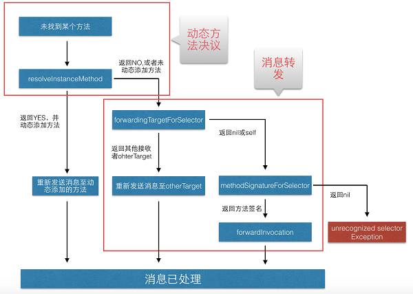
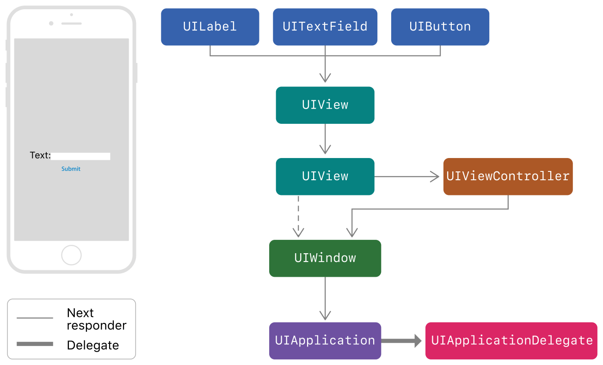

# Interview-Question

iOS 面试题积累 - iOS 篇

1. CALayer 中`anchorPoint` ` position`，UIView的 `transform` `CGAffineTransform` 概念

   - anchorPoint：称为“定位点”、“锚点”，决定着CALayer上哪个点会在position属性所指的位置。以自己的左上角为原点`(0, 0)`，它的x、y取值范围都是0 - 1，默认值为`(0.5, 0.5)`。

     ```
     /* Defines the anchor point of the layer's bounds rect, as a point in
     
     normalized layer coordinates - '(0, 0)' is the bottom left corner of
     
     the bounds rect, '(1, 1)' is the top right corner. Defaults to
     
     '(0.5, 0.5)', i.e. the center of the bounds rect. Animatable. */
     
     open var anchorPoint: CGPoint
     ```

   - position：用来设置CALayer在父层中的位置，以父层的左上角为原点`(0, 0)`。

     默认情况，假设UIView的Frame为`(startX, startY, width, height)`, 那么CALayer的position为`(startX + width / 2, startY + height / 2)`

     ```
     /* The position in the superlayer that the anchor point of the layer's
          * bounds rect is aligned to. Defaults to the zero point. Animatable. */
         
     open var position: CGPoint
     ```

   - CGAffineTransform：会影响subView。CGAffineTransform可以使控件产生移动、缩放、旋转效果，其坐标系统采用的是二维坐标系，坐标原点为屏幕的左上角，**向右为x轴正方向,向下为y轴正方向**。

     - `CGAffineTransformMakeTranslation`实现以初始位置为基准，在x轴方向上平移x单位，在y轴方向上平移y单位

       ```
       CGAffineTransformMakeTranslation(CGFloat tx, CGFloat ty)
       ```

     - `CGAffineTransformTranslate`在已有的transform基础上，增加 **移动** 效果

       ```swift
       CGAffineTransformTranslate(CGAffineTransform t, CGFloat tx, CGFloat ty)
       ```

     - `CGAffineTransformMakeScale`实现以初始位置为基准,在x轴方向上缩放x倍,在y轴方向上缩放y倍

       ```swfit
       CGAffineTransformMakeScale(CGFloat sx, CGFloat sy)
       ```

     - `CGAffineTransformScale`在已有的transform基础上，增加 **缩放** 效果

       ```swift
       CGAffineTransformScale(CGAffineTransform t, CGFloat sx, CGFloat sy)
       ```

     - `CGAffineTransformMakeRotation`实现以初始位置为基准,将坐标系统旋转angle弧度(弧度=π/180×角度,M_PI弧度代表180角度)

       ```swift
       CGAffineTransformMakeRotation(CGFloat angle)
       ```

     - `CGAffineTransformRotate`在已有的transform基础上，增加 **旋转** 效果

       ```swift
       CGAffineTransformRotate(CGAffineTransform t, CGFloat angle)
       ```

       参考：[UIView的transform属性使用--CGAffineTransform(仿射变换)](https://www.jianshu.com/p/bb0b1e627baf)

       

2. 贝塞尔曲线

   参考：[谈谈贝塞尔曲线](https://www.jianshu.com/p/c5949adc7ec1)

3. Block 中引用成员变量需要先判断self是否为nil，

   ```objective-c
   __weak typeof(self) wSelf = self;
   self.callBack = ^{
       __strong typeof(wSelf) sSelf = wSelf;
       if (sSelf) {
           self -> _foo = @"";
       }
   };
   ```

4. Weak关键字：属性所指的对象遭到摧毁时，属性值也会清空(nil out)。runtime实现weak关键字原理：hash 表

   > runtime 对注册的类， 会进行布局，对于 weak 对象会放入一个 hash 表中。 用 weak 指向的对象内存地址作为 key，value为weak指针的地址（这个地址的值是所指对象的地址）数组。当此对象的引用计数为0的时候会 dealloc，假如 weak 指向的对象内存地址是a，那么就会以a为键， 在这个 weak 表中搜索，找到所有以a为键的 weak 对象，从而设置为 nil。

5. NSProxy：涉及相关概念：消息转发

   > 翻译：NSProxy是一个抽象的超类，它定义了一个对象的API，用来充当其他对象或者一些不存在的对象的替身。通常，发送给Proxy的消息会被转发给实际对象，或使Proxy加载（转化为）实际对象。 NSProxy的子类可以用于实现透明的分布式消息传递(例如，NSDistantObject)，或者用于创建开销较大的对象的惰性实例化。

   - 模拟多继承
   - 解决NSTimer无法释放问题：[YYWeakProxy](https://github.com/ibireme/YYKit/blob/master/YYKit/Utility/YYWeakProxy.h)
   - 实现多个不同对象的消息分发

6. @synthesize和@dynamic分别有什么作用？

   > - 如果 @synthesize和 @dynamic都没写，那么默认的就是`@syntheszie var = _var;`
   >
   > - @synthesize 的语义是如果你没有手动实现 setter 方法和 getter 方法，那么编译器会自动为你加上这两个方法。
   >
   > - @dynamic 告诉编译器：属性的 setter 与 getter 方法由用户自己实现，不自动生成。（当然对于 readonly 的属性只需提供 getter 即可）。假如一个属性被声明为 @dynamic var，然后你没有提供 @setter方法和 @getter 方法，编译的时候没问题，但是当程序运行到 `instance.var = someVar`，由于缺 setter 方法会导致程序崩溃；或者当运行到 `someVar = var` 时，由于缺 getter 方法同样会导致崩溃。编译时没问题，运行时才执行相应的方法，这就是所谓的动态绑定。

7. NSTimer 的释放问题：可以采用block、NSProxy打破

参考：[NSTimer使用详解](https://juejin.im/post/5afaaf996fb9a07ac5604a92)

8. self & super

   经典题目，判断打印结果

   ```
   @implementation Son : Father
   - (id)init
   {
       self = [super init];
       if (self)
       {
           NSLog(@"%@", NSStringFromClass([self class]));
           NSLog(@"%@", NSStringFromClass([super class]));
       }
       return self;
   }
   @end
   ```

   结果：都是输出son。

   分析：不管是`self`、还是`super`，经过消息传递，最终处理消息的方法都是`NSObject`中的`- (Class)class`方法，指向消息接受者是一样的，都是son这个实例。

9. OC中对象的内存销毁时间表

   >a. 调用 -release ：引用计数变为零
   >
   >* 对象正在被销毁，生命周期即将结束.
   >* 不能再有新的 __weak 弱引用， 否则将指向 nil.
   >* 调用 [self dealloc] 
   >
   >b. 子类调用 -dealloc
   >
   >- 继承关系中最底层的子类 在调用 -dealloc
   >- 如果是 MRC 代码 则会手动释放实例变量们（iVars）
   >- 继承关系中每一层的父类 都在调用 -dealloc
   >
   >c. NSObject 调 -dealloc
   >
   >- 只做一件事：调用 Objective-C runtime 中的 object_dispose() 方法
   >
   >d. 调用 object_dispose()
   >
   >* 为 C++ 的实例变量们（iVars）调用 destructors 
   >* 为 ARC 状态下的 实例变量们（iVars） 调用 -release 
   >* 解除所有使用 runtime Associate方法关联的对象
   >* 解除所有 __weak 引用
   >* 调用 free()

   参考：[Will An Associated Object Be Released Automatically?](https://stackoverflow.com/questions/10842829/will-an-associated-object-be-released-automatically)

10. 消息转发（Message Forwarding）

    

    [图片来源](https://juejin.im/post/5a30c6fdf265da4319564272)

    - resolveInstanceMethod & resolveClassMethod：动态方法解析

      > 当根据selector没有找到对应的method时，首先会调用这个方法，在该方法中你可以为一个类添加一个方法。并返回yes。

    - forwardingTargetForSelector：快速转发

      >如果resolveInstanceMethod没有实现，返回No，或者没有动态添加方法的话，就会执行forwardingTargetForSelector。 在这里你可以返回一个能够执行这个selector的对象otherTarget，接下来消息会重新发送到这个otherTarget。

    - forwardInvocation：完整消息转发

      > 如果前两步没有执行，就会执行通过forwardInvocation进行消息转发。
      >
      > 还需要重写methodSignatureForSelector

    参考：a. [iOS 消息转发流程](https://juejin.im/post/5a30c6fdf265da4319564272)

    ​           b. [iOS开发·runtime原理与实践: 消息转发篇](https://juejin.im/post/5ae96e8c6fb9a07ac85a3860)

11. OC内存管理：retainCount

12. iOS线程、同步异步、串行并行队列

    - 从线程的时效来看，分别同步和异步

    > 同步：就是在发出一个功能调用时，在没有得到结果之前，该调用就不返回，程序也不会接着往下执行。按照这个定义，其实绝大多数函数都是同步调用。

    > 异步：当一个异步过程调用发出后，调用者不能立刻得到结果。实际处理这个调用的部件在完成后，通过状态、通知和回调（Handler机制）来通知调用者。

    - 从线程的执行来看，线程队列分为串行队列和并行队列

    > 串行和并行最大的不同的就是执行上，串行是依次执行，只有当前线程结束之后，另一个线程才开启。而并行是所有任务一起执行，执行的表现形式不同。

13. KVC Collection Operators(集合操作符)

    - Simple Collection Operators

      - `@count`返回一个值为集合中对象总数的NSNumber对象;

      - `@avg`首先把集合中的每个对象都转换为double类型,然后计算其平均值,并返回这个平均值的NSNumber对象;
      - `@max`使用compare:方法来确定最大值,并返回最大值的NSNumber对象.所以为了保证其正常比较,集合中所有的对象都必须支持和另一个对象的比较,保证其可比性;
      - `@min`原理和@max一样,其返回的是集合中的最小值的NSNumber对象;
      - `@sum`首先把集合中的每个对象都转换为double类型,然后计算其总和,并返回总和的NSNumber对象;

    ```objective-c
    NSArray *product = @[productA, productB, productC, productD];
    NSNumber *count = [product valueForKeyPath:@"@count.price"];
    NSNumber *avg = [product valueForKeyPath:@"@avg.price"];
    NSNumber *max = [product valueForKeyPath:@"@max.price"];
    NSNumber *min = [product valueForKeyPath:@"@min.price"];
    NSNumber *sum = [product valueForKeyPath:@"@sum.price"];
    NSLog(@"count:%@, avg:%@, max:%@, min:%@, sum:%@", count, avg, max, min, sum); 
    // count:4, avg:199, max:299, min:99, sum:796
    ```

    ```objective-c
    NSArray *array = @[@(productA.price), @(productB.price), @(productC.price), @(productD.price)];
    NSNumber *count = [array valueForKeyPath:@"@count"];
    NSNumber *avg = [array valueForKeyPath:@"@avg.self"];
    NSNumber *max = [array valueForKeyPath:@"@max.self"];
    NSNumber *min = [array valueForKeyPath:@"@min.self"];
    NSNumber *sum = [array valueForKeyPath:@"@sum.self"];
    NSLog(@"count:%@, avg:%@, max:%@, min:%@, sum:%@", count, avg, max, min, sum);
    //count:4, avg:199, max:299, min:99, sum:796
    ```

    - Object Operators

      - @unionOfObjects:`获取数组中每个对象的属性的值,放到一个数组中并返回,但不会去重;`The @unionOfObjects operator provides similar behavior, but without removing duplicate objects.
      - @distinctUnionOfObjects:`获取数组中每个对象的属性的值,放到一个数组中并返回,会对数组去重.所以,通常这个对象操作符可以用来对数组元素的去重,快捷高效;`The @distinctUnionOfArrays operator is similar, but removes duplicate objects.

      ```
      NSArray *unionOfObjects = [product valueForKeyPath:@"@unionOfObjects.name"];
      NSArray *distinctUnionOfObjects = [product valueForKeyPath:@"@distinctUnionOfObjects.name"];
      NSLog(@"unionOfObjects : %@", unionOfObjects);//iPod,iMac,iPhone,iPhone
      NSLog(@"distinctUnionOfObjects : %@", distinctUnionOfObjects);//iPhone,iPod,iMac
      ```

    - Array and Set Operators

      - `@distinctUnionOfArrays` 返回操作对象(数组)中的所有元素,即返回这个数组本身.会去重.

      - `@unionOfArrays` 首先获取操作对象(数组)中的所有元素,然后装到一个新的数组中并返回,不会对这个数组去重.

        ```
        NSArray *distinctUnionOfArrays = [@[product, product] valueForKeyPath:@"@distinctUnionOfArrays.price"];
        NSArray *unionOfArrays = [@[product, product] valueForKeyPath:@"@unionOfArrays.price"];
        NSLog(@"distinctUnionOfArrays : %@", distinctUnionOfArrays);//299,99,199
        NSLog(@"unionOfArrays : %@", unionOfArrays);//99,199,299,199,99,199,299,199
        ```

      - `@distinctUnionOfSets`返回操作对象（且操作对象内对象必须是数组/集合）中数组/集合的所有对象，返回值为集合.因为集合不能包含重复的值,所以它只有distinct操作

        ```objective-c
        NSSet *setA = [NSSet setWithObjects:productA, productB, nil];
        NSSet *setB = [NSSet setWithObjects:productC, productD, nil];
        NSSet *set = [NSSet setWithObjects:setA, setB, nil];
        
        NSSet *allSet = [set valueForKeyPath:@"@distinctUnionOfSets.name"];
        NSLog(@"distinctUnionOfSets: %@", allSet);//iPhone,iPod,iMac
        ```

    参考：[iOS KVC Collection Operators(集合操作符)](https://www.jianshu.com/p/2c2af5695904)

14. CADisplayLink

    > CADisplayLink是一个能让我们以和屏幕刷新率相同的频率将内容画到屏幕上的定时器。我们在应用中创建一个新的CADisplayLink对象，把它添加到一个runloop中，并给它提供一个target和selector在屏幕刷新的时候调用。

    与NSTimer的区别：

    >iOS设备的屏幕刷新频率是固定的，CADisplayLink在正常情况下会在每次刷新结束都被调用，精确度相当高。

    > NSTimer的精确度就显得低了点，比如NSTimer的触发时间到的时候，runloop如果在阻塞状态，触发时间就会推迟到下一个runloop周期。并且NSTimer新增了tolerance属性，让用户可以设置可以容忍的触发的时间的延迟范围。

    使用：

    ```objective-c
    self.displayLink= [CADisplayLink displayLinkWithTarget:selfselector:@selector(updateTextColor)];
    
    self.displayLink.paused=YES;
    
    [self.displayLinkaddToRunLoop:[NSRunLoop currentRunLoop] forMode:NSRunLoopCommonModes];
    
    -(void)updateTextColor{}
    
    - (void)startAnimation{
        
        self.beginTime= CACurrentMediaTime();
        self.displayLink.paused=NO;
    }
    ```

    iOS 10之后 `targetTimestamp` 改为 `preferredFramesPerSecond`
    
    ```objective-c
    /* Defines the desired callback rate in frames-per-second for this display
     * link. If set to zero, the default value, the display link will fire at the
     * native cadence of the display hardware. The display link will make a
     * best-effort attempt at issuing callbacks at the requested rate. */
    
    @property(nonatomic) NSInteger preferredFramesPerSecond
        API_AVAILABLE(ios(10.0), watchos(3.0), tvos(10.0));
    ```

15. Runloop

    Runloop 是和线程紧密相关的一个基础组件，是很多线程有关功能的幕后功臣。尽管在平常使用中几乎不太会直接用到，理解 Runloop 有利于我们更加深入地理解 iOS 的多线程模型。

    - Runloop 基本概念

      Runloop 是什么？Runloop 还是比较顾名思义的一个东西，说白了就是一种循环，只不过它这种循环比较高级。一般的 while 循环会导致 CPU 进入忙等待状态，而 Runloop 则是一种“闲”等待，这部分可以类比 Linux 下的 epoll。当没有事件时，Runloop 会进入休眠状态，有事件发生时， Runloop 会去找对应的 Handler 处理事件。Runloop 可以让线程在需要做事的时候忙起来，不需要的话就让线程休眠。

      Runloop 在线程中的作用：从 input source 和 timer source 接受事件，然后在线程中处理事件。

    - Runloop 与线程

      Runloop 和线程是绑定在一起的。每个线程（包括主线程）都有一个对应的 Runloop 对象。我们并不能自己创建 Runloop 对象，但是可以获取到系统提供的 Runloop 对象。

      主线程的 Runloop 会在应用启动的时候完成启动，其他线程的 Runloop 默认并不会启动，需要我们手动启动。

    - Input Source 和 Timer Source

      这两个都是 Runloop 事件的来源，其中 Input Source 又可以分为三类

      - Port-Based Sources，系统底层的 Port 事件，例如 CFSocketRef ，在应用层基本用不到
      - Custom Input Sources，用户手动创建的 Source
      - Cocoa Perform Selector Sources， Cocoa 提供的 performSelector 系列方法，也是一种事件源

      Timer Source 顾名思义就是指定时器事件了。

    - Runloop Observer

      Runloop 通过监控 Source 来决定有没有任务要做，除此之外，我们还可以用 Runloop Observer 来监控 Runloop 本身的状态。 Runloop Observer 可以监控下面的 runloop 事件：

      - The entrance to the run loop.
      - When the run loop is about to process a timer.
      - When the run loop is about to process an input source.
      - When the run loop is about to go to sleep.
      - When the run loop has woken up, but before it has processed the event that woke it up.
      - The exit from the run loop.

    - Runloop Mode

      在监视与被监视中，Runloop 要处理的事情还挺复杂的。为了让 Runloop 能专心处理自己关心的那部分事情，引入了 Runloop Mode 概念。

      

      如图所示，Runloop Mode 实际上是 Source，Timer 和 Observer 的集合，不同的 Mode 把不同组的 Source，Timer 和 Observer 隔绝开来。Runloop 在某个时刻只能跑在一个 Mode 下，处理这一个 Mode 当中的 Source，Timer 和 Observer。

      苹果文档中提到的 Mode 有五个，分别是：

      - NSDefaultRunLoopMode
      - NSConnectionReplyMode
      - NSModalPanelRunLoopMode
      - NSEventTrackingRunLoopMode
      - NSRunLoopCommonModes

      iOS 中公开暴露出来的只有 NSDefaultRunLoopMode 和 NSRunLoopCommonModes。 NSRunLoopCommonModes 实际上是一个 Mode 的集合，默认包括 NSDefaultRunLoopMode 和 NSEventTrackingRunLoopMode。

    - 与 Runloop 相关的坑

      日常开发中，与 runLoop 接触得最近可能就是通过 NSTimer 了。一个 Timer 一次只能加入到一个 RunLoop 中。我们日常使用的时候，通常就是加入到当前的 runLoop 的 default mode 中，而 ScrollView 在用户滑动时，主线程 RunLoop 会转到 UITrackingRunLoopMode 。而这个时候， Timer 就不会运行。

      有如下两种解决方案：

      - 第一种: 设置 RunLoop Mode，例如 NSTimer,我们指定它运行于 NSRunLoopCommonModes ，这是一个 Mode 的集合。注册到这个 Mode 下后，无论当前 runLoop 运行哪个 mode ，事件都能得到执行。
      - 第二种: 另一种解决 Timer 的方法是，我们在另外一个线程执行和处理 Timer 事件，然后在主线程更新 UI。

      在 AFNetworking 3.0 中，就有相关的代码，如下：

      ```objective-c
      - (void)startActivationDelayTimer {
        
          self.activationDelayTimer = [NSTimer
                                       timerWithTimeInterval:self.activationDelay target:self selector:@selector(activationDelayTimerFired) userInfo:nil repeats:NO];
        
          [[NSRunLoop mainRunLoop] addTimer:self.activationDelayTimer forMode:NSRunLoopCommonModes];
      }
      ```

      这里就是添加了一个计时器，由于指定了 NSRunLoopCommonModes，所以不管 RunLoop 出于什么状态，都执行这个计时器任务。

      参考：[ Runloop](https://hit-alibaba.github.io/interview/iOS/ObjC-Basic/Runloop.html)

16. 关联对象（associatedObject）

    >在分类中到底能否实现属性？其实在回答这个问题之前，首先要知道到底属性是什么？而属性的概念决定了这个问题的答案。
    >
    >- 如果你把属性理解为**通过方法访问的实例变量**，我相信这个问题的答案是不能，**因为分类不能为类增加额外的实例变量**。
    >- 不过如果属性只是一个**存取方法以及存储值的容器的集合**，那么分类是可以实现属性的。

    ```objective-c
    // 关联对象
    // 使用objc_setAssociatedObject函数可以给某个对象关联其他的对象。
    void objc_setAssociatedObject(id object, const void *key, id value, objc_AssociationPolicy policy)
     
    // 获取关联的对象
    // 使用objc_getAssociatedObject函数可以通过键来取出某个对象的关联对象。
    id objc_getAssociatedObject(id object, const void *key)
     
    // 移除关联的对象
    // 使用objc_removeAssociatedObjects函数可以移除某个对象身上的所有关联的对象。
    void objc_removeAssociatedObjects(id object)
    ```

    ```objective-c
    typedef OBJC_ENUM(uintptr_t, objc_AssociationPolicy) {
        OBJC_ASSOCIATION_ASSIGN = 0,           /**< Specifies a weak reference to the associated object. */
        OBJC_ASSOCIATION_RETAIN_NONATOMIC = 1, /**< Specifies a strong reference to the associated object. 
                                                *   The association is not made atomically. */
        OBJC_ASSOCIATION_COPY_NONATOMIC = 3,   /**< Specifies that the associated object is copied. 
                                                *   The association is not made atomically. */
        OBJC_ASSOCIATION_RETAIN = 01401,       /**< Specifies a strong reference to the associated object.
                                                *   The association is made atomically. */
        OBJC_ASSOCIATION_COPY = 01403          /**< Specifies that the associated object is copied.
                                                *   The association is made atomically. */
    };
    ```

    >关联对象又是如何实现并且管理的呢：
    >
    >- 关联对象其实就是 `ObjcAssociation` 对象
    >- 关联对象由 `AssociationsManager` 管理并在 `AssociationsHashMap` 存储
    >- 对象的指针以及其对应 `ObjectAssociationMap` 以键值对的形式存储在 `AssociationsHashMap` 中
    >- `ObjectAssociationMap` 则是用于存储关联对象的数据结构
    >- 每一个对象都有一个标记位 `has_assoc` 指示对象是否含有关联对象

    参考：[关联对象 AssociatedObject 完全解析](https://draveness.me/ao)

17. iOS各种锁

    a. OSSpinLock（自旋锁？）

    b. dispatch_semaphore（信号量）

    ```
    dispatch_semaphore_t signal = dispatch_semaphore_create(1); //传入值必须 >=0, 若传入为0则阻塞线程并等待timeout,时间到后会执行其后的语句
    dispatch_time_t overTime = dispatch_time(DISPATCH_TIME_NOW, 3.0f * NSEC_PER_SEC);
    
    //线程1
    dispatch_async(dispatch_get_global_queue(DISPATCH_QUEUE_PRIORITY_DEFAULT, 0), ^{
        NSLog(@"线程1 等待ing");
        dispatch_semaphore_wait(signal, overTime); //signal 值 -1
        NSLog(@"线程1");
        dispatch_semaphore_signal(signal); //signal 值 +1
        NSLog(@"线程1 发送信号");
    });
    ```

    > **dispatch_semaphore_create(1)：**传入值必须 `>=0`, 若传入为 `0`则阻塞线程并等待timeout,时间到后会执行其后的语句
    > **dispatch_semaphore_wait(signal, overTime)：**可以理解为 `lock`,会使得 `signal`值 `-1`
    > **dispatch_semaphore_signal(signal)：**可以理解为 `unlock`,会使得 `signal`值 `+1`

    关于信号量，我们可以用停车来比喻：

    >停车场剩余4个车位，那么即使同时来了四辆车也能停的下。如果此时来了五辆车，那么就有一辆需要等待。
    >**信号量的值（signal）**就相当于剩余车位的数目，`dispatch_semaphore_wait`函数就相当于来了一辆车，`dispatch_semaphore_signal`就相当于走了一辆车。停车位的剩余数目在初始化的时候就已经指明了（dispatch_semaphore_create（long value）），调用一次 dispatch_semaphore_signal，剩余的车位就增加一个；调用一次dispatch_semaphore_wait 剩余车位就减少一个；当剩余车位为 0 时，再来车（即调用 dispatch_semaphore_wait）就只能等待。有可能同时有几辆车等待一个停车位。有些车主没有耐心，给自己设定了一段等待时间，这段时间内等不到停车位就走了，如果等到了就开进去停车。而有些车主就像把车停在这，所以就一直等下去。
    >作者：ifelseboyxx链接：https://www.jianshu.com/p/8b8a01dd6356来源：简书简书著作权归作者所有，任何形式的转载都请联系作者获得授权并注明出处。

    c. pthread_mutex（互斥锁）（OSSpinLock不再安全，首选这个）

    ```
    static pthread_mutex_t pLock;
    pthread_mutex_init(&pLock, NULL);
     //1.线程1
    dispatch_async(dispatch_get_global_queue(DISPATCH_QUEUE_PRIORITY_DEFAULT, 0), ^{
        NSLog(@"线程1 准备上锁");
        pthread_mutex_lock(&pLock);
        sleep(3);
        NSLog(@"线程1");
        pthread_mutex_unlock(&pLock);
    });
    
    //1.线程2
    dispatch_async(dispatch_get_global_queue(DISPATCH_QUEUE_PRIORITY_DEFAULT, 0), ^{
        NSLog(@"线程2 准备上锁");
        pthread_mutex_lock(&pLock);
        NSLog(@"线程2");
        pthread_mutex_unlock(&pLock);
    });
    ```

    d. pthread_mutex(recursive)，递归锁

    ```
    static pthread_mutex_t pLock;
    pthread_mutexattr_t attr;
    pthread_mutexattr_init(&attr); //初始化attr并且给它赋予默认
    pthread_mutexattr_settype(&attr, PTHREAD_MUTEX_RECURSIVE); //设置锁类型，这边是设置为递归锁
    pthread_mutex_init(&pLock, &attr);
    pthread_mutexattr_destroy(&attr); //销毁一个属性对象，在重新进行初始化之前该结构不能重新使用
    
    //1.线程1
    dispatch_async(dispatch_get_global_queue(DISPATCH_QUEUE_PRIORITY_DEFAULT, 0), ^{
        static void (^RecursiveBlock)(int);
        RecursiveBlock = ^(int value) {
            pthread_mutex_lock(&pLock);
            if (value > 0) {
                NSLog(@"value: %d", value);
                RecursiveBlock(value - 1);
            }
            pthread_mutex_unlock(&pLock);
        };
        RecursiveBlock(5);
    });
    ```

    e. NSLock

    >**lock、unlock**：不多做解释，和上面一样
    >**trylock**：能加锁返回 YES 并执行**加锁**操作，相当于 lock，反之返回 NO
    >**lockBeforeDate**：这个方法表示会在传入的时间内尝试加锁，若能加锁则执行加锁操作并返回 YES，反之返回 NO

    f. NSCondition

    ```
    NSCondition *cLock = [NSCondition new];
    //线程1
    dispatch_async(dispatch_get_global_queue(DISPATCH_QUEUE_PRIORITY_DEFAULT, 0), ^{
        NSLog(@"start");
        [cLock lock];
        [cLock waitUntilDate:[NSDate dateWithTimeIntervalSinceNow:2]];
        NSLog(@"线程1");
        [cLock unlock];
    });
    ```

    g. NSRecursiveLock（递归锁）

    h. @synchronized（同步锁）

    i. NSConditionLock（条件锁）

    参考：[iOS 开发中的八种锁（Lock）](https://www.jianshu.com/p/8b8a01dd6356)

18. 响应链

    

    


----


待补充：

2. NSDictionary 底层原理：Hash表、负载因子、扩容
3. 响应链
4. +load +initialize

