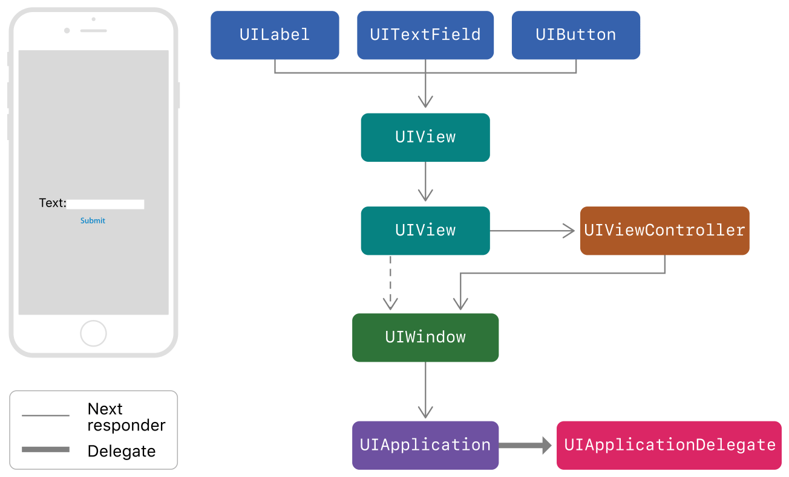

# Interview-Question

iOS 面试题积累 - iOS 篇

### 索引

1. [CALayer 中`anchorPoint` ` position`，UIView的 `transform` `CGAffineTransform` 概念](./interview-questions.md#1-calayer-中anchorpoint--positionuiview的-transform-cgaffinetransform-概念)
2. [贝塞尔曲线](./interview-questions.md#2-贝塞尔曲线)
3. [Block 中引用成员变量需要先判断self是否为nil](./interview-questions.md#3-block-中引用成员变量需要先判断self是否为nil)
4. [Weak关键字：属性所指的对象遭到摧毁时，属性值也会清空(nil out)。runtime实现weak关键字原理：hash 表](./interview-questions.md#4-weak关键字属性所指的对象遭到摧毁时属性值也会清空nil-outruntime实现weak关键字原理hash-表)
5. [NSProxy：涉及相关概念：消息转发](./interview-questions.md#5-nsproxy涉及相关概念消息转发)
6. [@synthesize和@dynamic分别有什么作用？](./interview-questions.md#6-synthesize和dynamic分别有什么作用)
7. [NSTimer 的释放问题：可以采用block、NSProxy打破](./interview-questions.md#7-nstimer-的释放问题可以采用blocknsproxy打破)
8. [self & super](./interview-questions.md#8-self--super)
9. [OC中对象的内存销毁时间表](./interview-questions.md#9-oc中对象的内存销毁时间表)
10. [消息转发（Message Forwarding）](./interview-questions.md#9-oc中对象的内存销毁时间表)
11. [OC内存管理：retainCount](./interview-questions.md#11-oc内存管理retaincount)
12. [iOS线程、同步异步、串行并行队列](./interview-questions.md#12-ios线程同步异步串行并行队列)
13. [KVC Collection Operators(集合操作符)](./interview-questions.md#13-kvc-collection-operators集合操作符)
14. [CADisplayLink](./interview-questions.md#14-cadisplaylink)
15. [Runloop](./interview-questions.md#15-runloop)
16. [关联对象（associatedObject）](./interview-questions.md#16-关联对象associatedobject)
17. [iOS各种锁](./interview-questions.md#17-ios各种锁)
18. [响应链](./interview-questions.md#17-ios各种锁)
19. [Category & Extension](./interview-questions.md#19-category--extension)
20. [NSDictionary 底层原理：Hash表、散列碰撞、负载因子、自动扩容、重Hash](./interview-questions.md#20-nsdictionary-底层原理hash表散列碰撞负载因子自动扩容重hash)
21. [+load & +initialize](./interview-questions.md#21-load--initialize)
22. [自动释放池（AutoReleasePool）](./interview-questions.md#22-自动释放池autoreleasepool)
23. [FMDB是线程安全的吗？](./interview-questions.md#23-fmdb是线程安全的吗)
24. [FPS如何计算](./interview-questions.md#24-fps如何计算)
25. [NSDateFormatter 性能问题](./interview-questions.md#25-nsdateformatter-性能问题)
26. [沙盒结构](./interview-questions.md#26-沙盒结构)
27. [循环引用、FaceBook第三方库FBRetainCycleDetector的实现原理](./interview-questions.md#27-循环引用facebook第三方库fbretaincycledetector的实现原理)
28. [Block原理](./interview-questions.md#28-block原理)

--------

### 1. CALayer 中`anchorPoint` ` position`，UIView的 `transform` `CGAffineTransform` 概念

- anchorPoint：称为“定位点”、“锚点”，决定着CALayer上哪个点会在position属性所指的位置。以自己的左上角为原点`(0, 0)`，它的x、y取值范围都是0 - 1，默认值为`(0.5, 0.5)`。

  ```
  /* Defines the anchor point of the layer's bounds rect, as a point in
  
  normalized layer coordinates - '(0, 0)' is the bottom left corner of
  
  the bounds rect, '(1, 1)' is the top right corner. Defaults to
  
  '(0.5, 0.5)', i.e. the center of the bounds rect. Animatable. */
  
  open var anchorPoint: CGPoint
  ```

- position：用来设置CALayer在父层中的位置，以父层的左上角为原点`(0, 0)`。

  默认情况，假设UIView的Frame为`(startX, startY, width, height)`, 那么CALayer的position为`(startX + width / 2, startY + height / 2)`

  ```
  /* The position in the superlayer that the anchor point of the layer's
       * bounds rect is aligned to. Defaults to the zero point. Animatable. */
      
  open var position: CGPoint
  ```

- CGAffineTransform：会影响subView。CGAffineTransform可以使控件产生移动、缩放、旋转效果，其坐标系统采用的是二维坐标系，坐标原点为屏幕的左上角，**向右为x轴正方向,向下为y轴正方向**。

  - `CGAffineTransformMakeTranslation`实现以初始位置为基准，在x轴方向上平移x单位，在y轴方向上平移y单位

    ```
    CGAffineTransformMakeTranslation(CGFloat tx, CGFloat ty)
    ```

  - `CGAffineTransformTranslate`在已有的transform基础上，增加 **移动** 效果

    ```swift
    CGAffineTransformTranslate(CGAffineTransform t, CGFloat tx, CGFloat ty)
    ```

  - `CGAffineTransformMakeScale`实现以初始位置为基准,在x轴方向上缩放x倍,在y轴方向上缩放y倍

    ```swfit
    CGAffineTransformMakeScale(CGFloat sx, CGFloat sy)
    ```

  - `CGAffineTransformScale`在已有的transform基础上，增加 **缩放** 效果

    ```swift
    CGAffineTransformScale(CGAffineTransform t, CGFloat sx, CGFloat sy)
    ```

  - `CGAffineTransformMakeRotation`实现以初始位置为基准,将坐标系统旋转angle弧度(弧度=π/180×角度,M_PI弧度代表180角度)

    ```swift
    CGAffineTransformMakeRotation(CGFloat angle)
    ```

  - `CGAffineTransformRotate`在已有的transform基础上，增加 **旋转** 效果

    ```swift
    CGAffineTransformRotate(CGAffineTransform t, CGFloat angle)
    ```

    参考：[UIView的transform属性使用--CGAffineTransform(仿射变换)](https://www.jianshu.com/p/bb0b1e627baf)

    

### 2. 贝塞尔曲线

参考：[谈谈贝塞尔曲线](https://www.jianshu.com/p/c5949adc7ec1)

### 3. Block 中引用成员变量需要先判断self是否为nil

```objective-c
__weak typeof(self) wSelf = self;
self.callBack = ^{
    __strong typeof(wSelf) sSelf = wSelf;
    if (sSelf) {
        self -> _foo = @"";
    }
};
```

### 4. Weak关键字：属性所指的对象遭到摧毁时，属性值也会清空(nil out)。runtime实现weak关键字原理：hash 表

> runtime 对注册的类， 会进行布局，对于 weak 对象会放入一个 hash 表中。 用 weak 指向的对象内存地址作为 key，value为weak指针的地址（这个地址的值是所指对象的地址）数组。当此对象的引用计数为0的时候会 dealloc，假如 weak 指向的对象内存地址是a，那么就会以a为键， 在这个 weak 表中搜索，找到所有以a为键的 weak 对象，从而设置为 nil。

### 5. NSProxy：涉及相关概念：消息转发

> 翻译：NSProxy是一个抽象的超类，它定义了一个对象的API，用来充当其他对象或者一些不存在的对象的替身。通常，发送给Proxy的消息会被转发给实际对象，或使Proxy加载（转化为）实际对象。 NSProxy的子类可以用于实现透明的分布式消息传递(例如，NSDistantObject)，或者用于创建开销较大的对象的惰性实例化。

- 模拟多继承
- 解决NSTimer无法释放问题：[YYWeakProxy](https://github.com/ibireme/YYKit/blob/master/YYKit/Utility/YYWeakProxy.h)
- 实现多个不同对象的消息分发

### 6. @synthesize和@dynamic分别有什么作用？

> - 如果 @synthesize和 @dynamic都没写，那么默认的就是`@syntheszie var = _var;`
>
> - @synthesize 的语义是如果你没有手动实现 setter 方法和 getter 方法，那么编译器会自动为你加上这两个方法。
>
> - @dynamic 告诉编译器：属性的 setter 与 getter 方法由用户自己实现，不自动生成。（当然对于 readonly 的属性只需提供 getter 即可）。假如一个属性被声明为 @dynamic var，然后你没有提供 @setter方法和 @getter 方法，编译的时候没问题，但是当程序运行到 `instance.var = someVar`，由于缺 setter 方法会导致程序崩溃；或者当运行到 `someVar = var` 时，由于缺 getter 方法同样会导致崩溃。编译时没问题，运行时才执行相应的方法，这就是所谓的动态绑定。

### 7. NSTimer 的释放问题：可以采用block、NSProxy打破

a . NSTimer 的释放问题：可以采用block、NSProxy打破

参考：[NSTimer使用详解](https://juejin.im/post/5afaaf996fb9a07ac5604a92)

b. NSTimer 的精确度

NSTimer的精确度一般能达到1ms，也就是小于1毫秒时，误差会很大。

原因：定时器被添加在主线程中，由于定时器在一个RunLoop中被检测一次，所以如果在这一次的RunLoop中做了耗时的操作，当前RunLoop持续的时间超过了定时器的间隔时间，那么下一次定时就被延后了。

c. 精准度更高的定时器

- 纳秒级精度的Timer

  ```
  #include <mach mach.h="">
   #include <mach mach_time.h="">
   static const uint64_t NANOS_PER_USEC = 1000ULL;
  
   static const uint64_t NANOS_PER_MILLISEC = 1000ULL * NANOS_PER_USEC;
   static const uint64_t NANOS_PER_SEC = 1000ULL * NANOS_PER_MILLISEC;
   static mach_timebase_info_data_t timebase_info;
  
   static uint64_t nanos_to_abs(uint64_t nanos) {
  
   return nanos * timebase_info.denom / timebase_info.numer;
  
   }
   void waitSeconds(int seconds) {
  
   mach_timebase_info(&timebase_info);
  
   uint64_t time_to_wait = nanos_to_abs(seconds * NANOS_PER_SEC);
  
   uint64_t now = mach_absolute_time();
  
   mach_wait_until(now + time_to_wait);
  
   }</mach></mach>
  //理论上这是iPhone上最精准的定时器，可以达到纳秒级别的精度
  ```

- CADisplayLink

  ```objective-c
  CADisplayLink * displayLink = [CADisplayLink displayLinkWithTarget:self selector:@selector(logInfo)];
   [displayLink addToRunLoop:[NSRunLoop currentRunLoop] forMode:NSRunLoopCommonModes];
  //CADisplayLink是一个频率能达到屏幕刷新率的定时器类。iPhone屏幕刷新频率为60帧/秒，也就是说最小间隔可以达到1/60s。
  ```

- GCD定时器

  ```objective-c
  NSTimeInterval interval = 1.0;
   _timer = dispatch_source_create(DISPATCH_SOURCE_TYPE_TIMER, 0, 0, dispatch_get_global_queue(DISPATCH_QUEUE_PRIORITY_DEFAULT, 0));
  
   dispatch_source_set_timer(_timer, dispatch_walltime(NULL, 0), interval * NSEC_PER_SEC, 0);
  
   dispatch_source_set_event_handler(_timer, ^{
  
   NSLog(@"GCD timer test");
  
   });
   dispatch_resume(_timer);
  //RunLoop是dispatch_source_t实现的timer，所以理论上来说，GCD定时器的精度比NSTimer只高不低。
  ```


### 8. self & super

经典题目，判断打印结果

```
@implementation Son : Father
- (id)init
{
    self = [super init];
    if (self)
    {
        NSLog(@"%@", NSStringFromClass([self class]));
        NSLog(@"%@", NSStringFromClass([super class]));
    }
    return self;
}
@end
```

结果：都是输出son。

分析：不管是`self`、还是`super`，经过消息传递，最终处理消息的方法都是`NSObject`中的`- (Class)class`方法，指向消息接受者是一样的，都是son这个实例。

### 9. OC中对象的内存销毁时间表

>a. 调用 -release ：引用计数变为零
>
>* 对象正在被销毁，生命周期即将结束.
>* 不能再有新的 __weak 弱引用， 否则将指向 nil.
>* 调用 [self dealloc] 
>
>b. 子类调用 -dealloc
>
>- 继承关系中最底层的子类 在调用 -dealloc
>- 如果是 MRC 代码 则会手动释放实例变量们（iVars）
>- 继承关系中每一层的父类 都在调用 -dealloc
>
>c. NSObject 调 -dealloc
>
>- 只做一件事：调用 Objective-C runtime 中的 object_dispose() 方法
>
>d. 调用 object_dispose()
>
>* 为 C++ 的实例变量们（iVars）调用 destructors 
>* 为 ARC 状态下的 实例变量们（iVars） 调用 -release 
>* 解除所有使用 runtime Associate方法关联的对象
>* 解除所有 __weak 引用
>* 调用 free()

参考：[Will An Associated Object Be Released Automatically?](https://stackoverflow.com/questions/10842829/will-an-associated-object-be-released-automatically)

### 10. 消息转发（Message Forwarding）


[图片来源](https://juejin.im/post/5a30c6fdf265da4319564272)

- resolveInstanceMethod & resolveClassMethod：动态方法解析

  > 当根据selector没有找到对应的method时，首先会调用这个方法，在该方法中你可以为一个类添加一个方法。并返回yes。

- forwardingTargetForSelector：快速转发

  >如果resolveInstanceMethod没有实现，返回No，或者没有动态添加方法的话，就会执行forwardingTargetForSelector。 在这里你可以返回一个能够执行这个selector的对象otherTarget，接下来消息会重新发送到这个otherTarget。

- forwardInvocation：完整消息转发

  > 如果前两步没有执行，就会执行通过forwardInvocation进行消息转发。
  >
  > 还需要重写methodSignatureForSelector

参考：a. [iOS 消息转发流程](https://juejin.im/post/5a30c6fdf265da4319564272)

​           b. [iOS开发·runtime原理与实践: 消息转发篇](https://juejin.im/post/5ae96e8c6fb9a07ac85a3860)

### 11. OC内存管理：retainCount

### 12. iOS线程、同步异步、串行并行队列

- 从线程的时效来看，分别同步和异步

> 同步：就是在发出一个功能调用时，在没有得到结果之前，该调用就不返回，程序也不会接着往下执行。按照这个定义，其实绝大多数函数都是同步调用。

> 异步：当一个异步过程调用发出后，调用者不能立刻得到结果。实际处理这个调用的部件在完成后，通过状态、通知和回调（Handler机制）来通知调用者。

- 从线程的执行来看，线程队列分为串行队列和并行队列

> 串行和并行最大的不同的就是执行上，串行是依次执行，只有当前线程结束之后，另一个线程才开启。而并行是所有任务一起执行，执行的表现形式不同。

### 13. KVC Collection Operators(集合操作符)

- Simple Collection Operators

  - `@count`返回一个值为集合中对象总数的NSNumber对象;

  - `@avg`首先把集合中的每个对象都转换为double类型,然后计算其平均值,并返回这个平均值的NSNumber对象;
  - `@max`使用compare:方法来确定最大值,并返回最大值的NSNumber对象.所以为了保证其正常比较,集合中所有的对象都必须支持和另一个对象的比较,保证其可比性;
  - `@min`原理和@max一样,其返回的是集合中的最小值的NSNumber对象;
  - `@sum`首先把集合中的每个对象都转换为double类型,然后计算其总和,并返回总和的NSNumber对象;

```objective-c
NSArray *product = @[productA, productB, productC, productD];
NSNumber *count = [product valueForKeyPath:@"@count.price"];
NSNumber *avg = [product valueForKeyPath:@"@avg.price"];
NSNumber *max = [product valueForKeyPath:@"@max.price"];
NSNumber *min = [product valueForKeyPath:@"@min.price"];
NSNumber *sum = [product valueForKeyPath:@"@sum.price"];
NSLog(@"count:%@, avg:%@, max:%@, min:%@, sum:%@", count, avg, max, min, sum); 
// count:4, avg:199, max:299, min:99, sum:796
```

```objective-c
NSArray *array = @[@(productA.price), @(productB.price), @(productC.price), @(productD.price)];
NSNumber *count = [array valueForKeyPath:@"@count"];
NSNumber *avg = [array valueForKeyPath:@"@avg.self"];
NSNumber *max = [array valueForKeyPath:@"@max.self"];
NSNumber *min = [array valueForKeyPath:@"@min.self"];
NSNumber *sum = [array valueForKeyPath:@"@sum.self"];
NSLog(@"count:%@, avg:%@, max:%@, min:%@, sum:%@", count, avg, max, min, sum);
//count:4, avg:199, max:299, min:99, sum:796
```

- Object Operators

  - @unionOfObjects:`获取数组中每个对象的属性的值,放到一个数组中并返回,但不会去重;`The @unionOfObjects operator provides similar behavior, but without removing duplicate objects.
  - @distinctUnionOfObjects:`获取数组中每个对象的属性的值,放到一个数组中并返回,会对数组去重.所以,通常这个对象操作符可以用来对数组元素的去重,快捷高效;`The @distinctUnionOfArrays operator is similar, but removes duplicate objects.

  ```
  NSArray *unionOfObjects = [product valueForKeyPath:@"@unionOfObjects.name"];
  NSArray *distinctUnionOfObjects = [product valueForKeyPath:@"@distinctUnionOfObjects.name"];
  NSLog(@"unionOfObjects : %@", unionOfObjects);//iPod,iMac,iPhone,iPhone
  NSLog(@"distinctUnionOfObjects : %@", distinctUnionOfObjects);//iPhone,iPod,iMac
  ```

- Array and Set Operators

  - `@distinctUnionOfArrays` 返回操作对象(数组)中的所有元素,即返回这个数组本身.会去重.

  - `@unionOfArrays` 首先获取操作对象(数组)中的所有元素,然后装到一个新的数组中并返回,不会对这个数组去重.

    ```
    NSArray *distinctUnionOfArrays = [@[product, product] valueForKeyPath:@"@distinctUnionOfArrays.price"];
    NSArray *unionOfArrays = [@[product, product] valueForKeyPath:@"@unionOfArrays.price"];
    NSLog(@"distinctUnionOfArrays : %@", distinctUnionOfArrays);//299,99,199
    NSLog(@"unionOfArrays : %@", unionOfArrays);//99,199,299,199,99,199,299,199
    ```

  - `@distinctUnionOfSets`返回操作对象（且操作对象内对象必须是数组/集合）中数组/集合的所有对象，返回值为集合.因为集合不能包含重复的值,所以它只有distinct操作

    ```objective-c
    NSSet *setA = [NSSet setWithObjects:productA, productB, nil];
    NSSet *setB = [NSSet setWithObjects:productC, productD, nil];
    NSSet *set = [NSSet setWithObjects:setA, setB, nil];
    
    NSSet *allSet = [set valueForKeyPath:@"@distinctUnionOfSets.name"];
    NSLog(@"distinctUnionOfSets: %@", allSet);//iPhone,iPod,iMac
    ```

参考：[iOS KVC Collection Operators(集合操作符)](https://www.jianshu.com/p/2c2af5695904)

### 14. CADisplayLink

> CADisplayLink是一个能让我们以和屏幕刷新率相同的频率将内容画到屏幕上的定时器。我们在应用中创建一个新的CADisplayLink对象，把它添加到一个runloop中，并给它提供一个target和selector在屏幕刷新的时候调用。

与NSTimer的区别：

>iOS设备的屏幕刷新频率是固定的，CADisplayLink在正常情况下会在每次刷新结束都被调用，精确度相当高。

> NSTimer的精确度就显得低了点，比如NSTimer的触发时间到的时候，runloop如果在阻塞状态，触发时间就会推迟到下一个runloop周期。并且NSTimer新增了tolerance属性，让用户可以设置可以容忍的触发的时间的延迟范围。

使用：

```objective-c
self.displayLink= [CADisplayLink displayLinkWithTarget:selfselector:@selector(updateTextColor)];

self.displayLink.paused=YES;

[self.displayLinkaddToRunLoop:[NSRunLoop currentRunLoop] forMode:NSRunLoopCommonModes];

-(void)updateTextColor{}

- (void)startAnimation{
    
    self.beginTime= CACurrentMediaTime();
    self.displayLink.paused=NO;
}
```

iOS 10之后 `targetTimestamp` 改为 `preferredFramesPerSecond`

```objective-c
/* Defines the desired callback rate in frames-per-second for this display
 * link. If set to zero, the default value, the display link will fire at the
 * native cadence of the display hardware. The display link will make a
 * best-effort attempt at issuing callbacks at the requested rate. */

@property(nonatomic) NSInteger preferredFramesPerSecond
    API_AVAILABLE(ios(10.0), watchos(3.0), tvos(10.0));
```

### 15. Runloop

Runloop 是和线程紧密相关的一个基础组件，是很多线程有关功能的幕后功臣。尽管在平常使用中几乎不太会直接用到，理解 Runloop 有利于我们更加深入地理解 iOS 的多线程模型。

- Runloop 基本概念

  Runloop 是什么？Runloop 还是比较顾名思义的一个东西，说白了就是一种循环，只不过它这种循环比较高级。一般的 while 循环会导致 CPU 进入忙等待状态，而 Runloop 则是一种“闲”等待，这部分可以类比 Linux 下的 epoll。当没有事件时，Runloop 会进入休眠状态，有事件发生时， Runloop 会去找对应的 Handler 处理事件。Runloop 可以让线程在需要做事的时候忙起来，不需要的话就让线程休眠。

  Runloop 在线程中的作用：从 input source 和 timer source 接受事件，然后在线程中处理事件。

- Runloop 与线程

  Runloop 和线程是绑定在一起的。每个线程（包括主线程）都有一个对应的 Runloop 对象。我们并不能自己创建 Runloop 对象，但是可以获取到系统提供的 Runloop 对象。

  主线程的 Runloop 会在应用启动的时候完成启动，其他线程的 Runloop 默认并不会启动，需要我们手动启动。

- Input Source 和 Timer Source

  这两个都是 Runloop 事件的来源，其中 Input Source 又可以分为三类

  - Port-Based Sources，系统底层的 Port 事件，例如 CFSocketRef ，在应用层基本用不到
  - Custom Input Sources，用户手动创建的 Source
  - Cocoa Perform Selector Sources， Cocoa 提供的 performSelector 系列方法，也是一种事件源

  Timer Source 顾名思义就是指定时器事件了。

- Runloop Observer

  Runloop 通过监控 Source 来决定有没有任务要做，除此之外，我们还可以用 Runloop Observer 来监控 Runloop 本身的状态。 Runloop Observer 可以监控下面的 runloop 事件：

  - The entrance to the run loop.
  - When the run loop is about to process a timer.
  - When the run loop is about to process an input source.
  - When the run loop is about to go to sleep.
  - When the run loop has woken up, but before it has processed the event that woke it up.
  - The exit from the run loop.

- Runloop Mode

  在监视与被监视中，Runloop 要处理的事情还挺复杂的。为了让 Runloop 能专心处理自己关心的那部分事情，引入了 Runloop Mode 概念。

  

  如图所示，Runloop Mode 实际上是 Source，Timer 和 Observer 的集合，不同的 Mode 把不同组的 Source，Timer 和 Observer 隔绝开来。Runloop 在某个时刻只能跑在一个 Mode 下，处理这一个 Mode 当中的 Source，Timer 和 Observer。

  苹果文档中提到的 Mode 有五个，分别是：

  - NSDefaultRunLoopMode
  - NSConnectionReplyMode
  - NSModalPanelRunLoopMode
  - NSEventTrackingRunLoopMode
  - NSRunLoopCommonModes

  iOS 中公开暴露出来的只有 NSDefaultRunLoopMode 和 NSRunLoopCommonModes。 NSRunLoopCommonModes 实际上是一个 Mode 的集合，默认包括 NSDefaultRunLoopMode 和 NSEventTrackingRunLoopMode。

- 与 Runloop 相关的坑

  日常开发中，与 runLoop 接触得最近可能就是通过 NSTimer 了。一个 Timer 一次只能加入到一个 RunLoop 中。我们日常使用的时候，通常就是加入到当前的 runLoop 的 default mode 中，而 ScrollView 在用户滑动时，主线程 RunLoop 会转到 UITrackingRunLoopMode 。而这个时候， Timer 就不会运行。

  有如下两种解决方案：

  - 第一种: 设置 RunLoop Mode，例如 NSTimer,我们指定它运行于 NSRunLoopCommonModes ，这是一个 Mode 的集合。注册到这个 Mode 下后，无论当前 runLoop 运行哪个 mode ，事件都能得到执行。
  - 第二种: 另一种解决 Timer 的方法是，我们在另外一个线程执行和处理 Timer 事件，然后在主线程更新 UI。

  在 AFNetworking 3.0 中，就有相关的代码，如下：

  ```objective-c
  - (void)startActivationDelayTimer {
    
      self.activationDelayTimer = [NSTimer
                                   timerWithTimeInterval:self.activationDelay target:self selector:@selector(activationDelayTimerFired) userInfo:nil repeats:NO];
    
      [[NSRunLoop mainRunLoop] addTimer:self.activationDelayTimer forMode:NSRunLoopCommonModes];
  }
  ```

  这里就是添加了一个计时器，由于指定了 NSRunLoopCommonModes，所以不管 RunLoop 出于什么状态，都执行这个计时器任务。

  参考：[ Runloop](https://hit-alibaba.github.io/interview/iOS/ObjC-Basic/Runloop.html)

### 16. 关联对象（associatedObject）

>在分类中到底能否实现属性？其实在回答这个问题之前，首先要知道到底属性是什么？而属性的概念决定了这个问题的答案。
>
>- 如果你把属性理解为**通过方法访问的实例变量**，我相信这个问题的答案是不能，**因为分类不能为类增加额外的实例变量**。
>- 不过如果属性只是一个**存取方法以及存储值的容器的集合**，那么分类是可以实现属性的。

```objective-c
// 关联对象
// 使用objc_setAssociatedObject函数可以给某个对象关联其他的对象。
void objc_setAssociatedObject(id object, const void *key, id value, objc_AssociationPolicy policy)
 
// 获取关联的对象
// 使用objc_getAssociatedObject函数可以通过键来取出某个对象的关联对象。
id objc_getAssociatedObject(id object, const void *key)
 
// 移除关联的对象
// 使用objc_removeAssociatedObjects函数可以移除某个对象身上的所有关联的对象。
void objc_removeAssociatedObjects(id object)
```

```objective-c
typedef OBJC_ENUM(uintptr_t, objc_AssociationPolicy) {
    OBJC_ASSOCIATION_ASSIGN = 0,           /**< Specifies a weak reference to the associated object. */
    OBJC_ASSOCIATION_RETAIN_NONATOMIC = 1, /**< Specifies a strong reference to the associated object. 
                                            *   The association is not made atomically. */
    OBJC_ASSOCIATION_COPY_NONATOMIC = 3,   /**< Specifies that the associated object is copied. 
                                            *   The association is not made atomically. */
    OBJC_ASSOCIATION_RETAIN = 01401,       /**< Specifies a strong reference to the associated object.
                                            *   The association is made atomically. */
    OBJC_ASSOCIATION_COPY = 01403          /**< Specifies that the associated object is copied.
                                            *   The association is made atomically. */
};
```

>关联对象又是如何实现并且管理的呢：
>
>- 关联对象其实就是 `ObjcAssociation` 对象
>- 关联对象由 `AssociationsManager` 管理并在 `AssociationsHashMap` 存储
>- 对象的指针以及其对应 `ObjectAssociationMap` 以键值对的形式存储在 `AssociationsHashMap` 中
>- `ObjectAssociationMap` 则是用于存储关联对象的数据结构
>- 每一个对象都有一个标记位 `has_assoc` 指示对象是否含有关联对象

参考：[关联对象 AssociatedObject 完全解析](https://draveness.me/ao)

### 17. iOS各种锁

a. OSSpinLock（自旋锁？）

b. dispatch_semaphore（信号量）

```
dispatch_semaphore_t signal = dispatch_semaphore_create(1); //传入值必须 >=0, 若传入为0则阻塞线程并等待timeout,时间到后会执行其后的语句
dispatch_time_t overTime = dispatch_time(DISPATCH_TIME_NOW, 3.0f * NSEC_PER_SEC);

//线程1
dispatch_async(dispatch_get_global_queue(DISPATCH_QUEUE_PRIORITY_DEFAULT, 0), ^{
    NSLog(@"线程1 等待ing");
    dispatch_semaphore_wait(signal, overTime); //signal 值 -1
    NSLog(@"线程1");
    dispatch_semaphore_signal(signal); //signal 值 +1
    NSLog(@"线程1 发送信号");
});
```

> **dispatch_semaphore_create(1)：**传入值必须 `>=0`, 若传入为 `0`则阻塞线程并等待timeout,时间到后会执行其后的语句
> **dispatch_semaphore_wait(signal, overTime)：**可以理解为 `lock`,会使得 `signal`值 `-1`
> **dispatch_semaphore_signal(signal)：**可以理解为 `unlock`,会使得 `signal`值 `+1`

关于信号量，我们可以用停车来比喻：

>停车场剩余4个车位，那么即使同时来了四辆车也能停的下。如果此时来了五辆车，那么就有一辆需要等待。
>**信号量的值（signal）**就相当于剩余车位的数目，`dispatch_semaphore_wait`函数就相当于来了一辆车，`dispatch_semaphore_signal`就相当于走了一辆车。停车位的剩余数目在初始化的时候就已经指明了（dispatch_semaphore_create（long value）），调用一次 dispatch_semaphore_signal，剩余的车位就增加一个；调用一次dispatch_semaphore_wait 剩余车位就减少一个；当剩余车位为 0 时，再来车（即调用 dispatch_semaphore_wait）就只能等待。有可能同时有几辆车等待一个停车位。有些车主没有耐心，给自己设定了一段等待时间，这段时间内等不到停车位就走了，如果等到了就开进去停车。而有些车主就像把车停在这，所以就一直等下去。
>作者：ifelseboyxx链接：https://www.jianshu.com/p/8b8a01dd6356来源：简书简书著作权归作者所有，任何形式的转载都请联系作者获得授权并注明出处。

c. pthread_mutex（互斥锁）（OSSpinLock不再安全，首选这个）

```
static pthread_mutex_t pLock;
pthread_mutex_init(&pLock, NULL);
 //1.线程1
dispatch_async(dispatch_get_global_queue(DISPATCH_QUEUE_PRIORITY_DEFAULT, 0), ^{
    NSLog(@"线程1 准备上锁");
    pthread_mutex_lock(&pLock);
    sleep(3);
    NSLog(@"线程1");
    pthread_mutex_unlock(&pLock);
});

//1.线程2
dispatch_async(dispatch_get_global_queue(DISPATCH_QUEUE_PRIORITY_DEFAULT, 0), ^{
    NSLog(@"线程2 准备上锁");
    pthread_mutex_lock(&pLock);
    NSLog(@"线程2");
    pthread_mutex_unlock(&pLock);
});
```

d. pthread_mutex(recursive)，递归锁

```
static pthread_mutex_t pLock;
pthread_mutexattr_t attr;
pthread_mutexattr_init(&attr); //初始化attr并且给它赋予默认
pthread_mutexattr_settype(&attr, PTHREAD_MUTEX_RECURSIVE); //设置锁类型，这边是设置为递归锁
pthread_mutex_init(&pLock, &attr);
pthread_mutexattr_destroy(&attr); //销毁一个属性对象，在重新进行初始化之前该结构不能重新使用

//1.线程1
dispatch_async(dispatch_get_global_queue(DISPATCH_QUEUE_PRIORITY_DEFAULT, 0), ^{
    static void (^RecursiveBlock)(int);
    RecursiveBlock = ^(int value) {
        pthread_mutex_lock(&pLock);
        if (value > 0) {
            NSLog(@"value: %d", value);
            RecursiveBlock(value - 1);
        }
        pthread_mutex_unlock(&pLock);
    };
    RecursiveBlock(5);
});
```

e. NSLock

>**lock、unlock**：不多做解释，和上面一样
>**trylock**：能加锁返回 YES 并执行**加锁**操作，相当于 lock，反之返回 NO
>**lockBeforeDate**：这个方法表示会在传入的时间内尝试加锁，若能加锁则执行加锁操作并返回 YES，反之返回 NO

f. NSCondition

```
NSCondition *cLock = [NSCondition new];
//线程1
dispatch_async(dispatch_get_global_queue(DISPATCH_QUEUE_PRIORITY_DEFAULT, 0), ^{
    NSLog(@"start");
    [cLock lock];
    [cLock waitUntilDate:[NSDate dateWithTimeIntervalSinceNow:2]];
    NSLog(@"线程1");
    [cLock unlock];
});
```

g. NSRecursiveLock（递归锁）

h. @synchronized（同步锁）

i. NSConditionLock（条件锁）

参考：[iOS 开发中的八种锁（Lock）](https://www.jianshu.com/p/8b8a01dd6356)

### 18. 响应链

当用户的手指点击屏幕的时候，iOS操作系统通过触摸屏获取用户的点击行为，然后把这个点击信息包装成UITouch和UIEvent形式的实例，然后找到当前运行的程序，在这个程序中逐级寻找能够响应这个事件的所有对象，然后把这些对象放入一个链表，这个链表就是iOS的响应链。

 UIResponder提供了四个方法来响应点击事件：

```objective-c
- (void)touchesBegan:(NSSet *)touches withEvent:(UIEvent *)event;
- (void)touchesMoved:(NSSet *)touches withEvent:(UIEvent *)event;
- (void)touchesEnded:(NSSet *)touches withEvent:(UIEvent *)event;
- (void)touchesCancelled:(NSSet *)touches withEvent:(UIEvent *)event;
```

举例：用户点击了某个View，系统会接收到这个点击事件，然后调用：

```
- (BOOL)pointInside:(CGPoint)point withEvent:(nullable UIEvent *)event;  
```

方法，该方法是判断点击的点是够在本对象内，如果返回true则继续调用：

```
- (nullable UIView *)hitTest:(CGPoint)point withEvent:(nullable UIEvent *)event;
```

**事件的传递是从上到下的，事件的响应是从下到上的。**

响应链已经建立起来，那么下面就该响应用户刚才的那次点击了，首先找到第一响应者DView，看他有没有处理这次点击事件，如果DView不处理就通过响应链找到它的nextResponder-CView，CView如果也不处理就会一直向上寻找，如果最终找到响应链的最后一个响应者AppDelegate也不处理，就会丢弃这次点击事件。



参考：[iOS 响应链](https://juejin.im/entry/58f5b7d0570c35005648a1ba)

### 19. Category & Extension

a. Category的作用

- 为已经存在的类添加方法
- 把类的实现分开在几个不同的文件里面
- 声明私有方法
- 模拟多继承（少用、不重要）
- 把framework的私有方法公开

b. Category的理解

> category只能给某个已有的类扩充方法，不能扩充成员变量。
>
> category中也可以添加属性，只不过@property只会生成setter和getter的声明，不会生成setter和getter的实现以及成员变量。
>
> 如果category中的方法和类中原有方法同名，运行时会优先调用category中的方法。也就是，category中的方法会覆盖掉类中原有的方法。所以开发中尽量保证不要让分类中的方法和原有类中的方法名相同。避免出现这种情况的解决方案是给分类的方法名统一添加前缀。比如category_。
>
> 如果多个category中存在同名的方法，运行时到底调用哪个方法由编译器决定，最后一个参与编译的方法会被调用。
>
> 注意：category是在运行时加载的，不是在编译时。

c .Extension的理解

extension被开发者称之为扩展、延展、匿名分类。extension看起来很像一个匿名的category，但是extension和category几乎完全是两个东西。和category不同的是extension不但可以声明方法，还可以声明属性、成员变量。extension一般用于声明私有方法，私有属性，私有成员变量。Extension经常寄生于一个类的.m文件中。

d.两者的差别

- extension和category都可以添加属性，但是category的属性不能生成成员变量和getter、setter方法的实现
- extension一般用来隐藏类的私有信息，你必须有一个类的源码才能为一个类添加extension，所以你无法为系统的类比如NSString添加extension，除非创建子类再添加extension。而category不需要有类的源码，我们可以给系统提供的类添加category
- extension在编译期决议，它就是类的一部分，但是category则完全不一样，它是在运行期决议的。extension在编译期和头文件里的@interface以及实现文件里的@implement一起形成一个完整的类，它、extension伴随类的产生而产生，亦随之一起消亡

### 20. NSDictionary 底层原理：Hash表、散列碰撞、负载因子、自动扩容、重Hash

> NSDictionary（字典）是使用 hash表来实现key和value之间的映射和存储的， hash函数设计的好坏影响着数据的查找访问效率。数据在hash表中分布的越均匀，其访问效率越高。而在Objective-C中，通常都是利用NSString 来作为键值，其内部使用的hash函数也是通过使用 NSString对象作为键值来保证数据的各个节点在hash表中均匀分布。

**哈希表（hash表）：又叫做散列表，是根据关键码值（key value）而直接访问的数据结构**。也就是说它通过关键码值映射到表中一个位置来访问记录，以加快查找的速度。这个映射叫做**函数**，存放记录的**数组**叫做**哈希表**。

> 在oc中每一个对象创建时，都默认生成一个hashCode,也就是经过hash算法生成的一串数字，当利用key去取字典中的value时，若是使用遍历或者二分查找等方法，效率相对较低，于是出现了根据每一个key生成的hashCode将键值对放到hasCode对应的数组中的指定位置，这样当用key去取值时，便不必遍历去获取，既可以根据hashCode直接取出。因为hashCode的值过大，或许经过取余获取一个较小的数字，假如是对999进行取余运算，那么得到的结果始终处于0-999之间。但是，这样做的弊端在于取余所得到的值，可能是相同的，这样可能导致完全不相干的键值对被新的键值对（取余后值key相等）所覆盖，于是出现了数组中套链表实现的数组。这样，key值取余得到值相等的键值对，都将保存在同一个链表数组中，当查找key对应的值时，首先获取到该链表数组，然后遍历数组，取正确的key所对应的值即可。

作为key值，必须遵循NSCopying协议，除了NSString对象之外，我们还可以使用其他类型对象来作为NSDictionary的 key值。不过这还不够，作为key值，该类型还必须继承于NSObject并且要重载一下两个方法：

```
- (NSUInteger)hash;  
- (BOOL)isEqual:(id)object;  
```

其中，hash 方法是用来计算该对象的 hash 值，最终的 hash 值决定了该对象在 hash 表中存储的位置。所以同样，如果想重写该方法，我们尽量设计一个能让数据分布均匀的 hash 函数。

**所以如果对象key的hash值相同，那在hash表里面的对应的value值是相同的**(value值被更新了)

isEqual方法是为了通过hash值来找到对象在hash表中的位置。

**简单总结：NSDictionary底层是一个Hash表，由key计算出hash值作为下标，value为键值对组成的链表，查找字典中的value时通过key计算出hash值取到相应的链表，然后遍历链表找到对应key的value。**

参考：a. [NSDictionary底层实现原理](https://juejin.im/post/5b615c8de51d451989056a1b)

​           b. [iOS底层原理：NSDictionary原理](https://www.jianshu.com/p/0d7cd6341f65)      

###  21. +load & +initialize

- +load

  当类被引用进项目的时候就会执行load函数(在main函数开始执行之前），与这个类是否被用到无关，每个类的load函数只会自动调用一次。由于load函数是系统自动加载的，因此不需要调用父类的load函数，否则父类的load函数会多次执行。

  - 当父类和子类都实现load函数时，父类的load方法执行顺序要优先于子类
  - 当子类未实现load方法时，不会调用父类load方法
  - 类中的load方法执行顺序要优先于类别(Category)
  - 当有多个类别(Category)都实现了load方法，这几个load方法都会执行，但执行顺序不确定(其执行顺序与类别在Compile Sources中出现的顺序一致)
  - 当然当有多个不同的类的时候,每个类load 执行顺序与其在Compile Sources出现的顺序一致

- +initialize

  initialize在类或者其子类的第一个方法被调用前调用。即使类文件被引用进项目，但是没有使用，initialize不会被调用。由于是系统自动调用，也不需要再调用 [super initialize] ，否则父类的initialize会被多次执行。假如这个类放到代码中，而这段代码并没有被执行，这个函数是不会被执行的。

  - 父类的initialize方法会比子类先执行
  - 当子类未实现initialize方法时，会调用父类initialize方法，子类实现initialize方法时，会覆盖父类initialize方法.
  - 当有多个Category都实现了initialize方法，会覆盖类中的方法，只执行一个(会执行Compile Sources 列表中最后一个Category 的initialize方法)

- +load & +initialize 使用场景

  调用load方法时的环境很不安全，我们应该尽量减少load方法的逻辑；

  load方法是线程安全的，它内部使用了锁，所以我们应该避免线程阻塞在load方法中；

  load很常见的一个使用场景，runtime交换两个方法的实现（method swizzling）；

  initialize方法主要用来对一些不方便在编译期初始化的对象进行赋值。比如NSMutableArray这种类型的实例化依赖于runtime的消息发送，所以显然无法在编译器初始化；

参考：[iOS类方法load和initialize详解](https://juejin.im/post/5a31dc40f265da4307034712)

### 22. 自动释放池（AutoReleasePool）

> AutoreleasePool并没有单独的结构，而是由一个个 AutoreleasePoolPage 组成的，一个page是4096字节大小，每个 AutoreleasePoolPage 以双向链表连接起来形成一个自动释放池
>
> 当对象调用 autorelease 方法时，会将对象加入 AutoreleasePoolPage 的栈中
>
> pop 时是传入边界对象,然后对page 中的对象发送release 的消息
>
> 单个自动释放池的执行过程就是`objc_autoreleasePoolPush()` —> `[object autorelease]` —> `objc_autoreleasePoolPop(void *)`。

参考：[AutoreleasePool底层实现原理](https://juejin.im/post/5b052282f265da0b7156a2aa)

### 23. FMDB是线程安全的吗？

- `SQLITE`线程安全, 与`FMDB多线程安全`是两回事；
- `SQLITE`默认的线程模式是`串行模式`, 是线程安全的；
- `FMDatabase`多线程不安全, 单个`FMDatabaseQueue`是多线程安全的；
- 为什么`FMDatabaseQueue`
  - 其多线程是在不同子线程把任务追加`_queue`中
  - 真正操作数据库的任务还是有`_queue`来分配
  - `_queue`是一个串行队列, 且是同步执行, 所以所有任务是一个接一个执行, 并不会造成资源抢夺

### 24. FPS如何计算

卡顿原因：

>在 VSync 信号到来后，系统图形服务会通过 `CADisplayLink` 等机制通知 App，App 主线程开始在 CPU 中计算显示内容，比如视图的创建、布局计算、图片解码、文本绘制等。随后 CPU 会将计算好的内容提交到 GPU 去，由 GPU 进行变换、合成、渲染。随后 GPU 会把渲染结果提交到帧缓冲区去，等待下一次 VSync 信号到来时显示到屏幕上。由于垂直同步的机制，如果在一个 VSync 时间内，CPU 或者 GPU 没有完成内容提交，则那一帧就会被丢弃，等待下一次机会再显示，而这时显示屏会保留之前的内容不变。这就是界面卡顿的原因。

卡顿监控常见方案：

- FPS 监控：通过 `CADisplayLink` 来获取每一帧的耗时，进而计算出 FPS。
- 通过开辟一个子线程监听 runLoop 状态变化来计算停留在各个状态的时间，当 runloop 处于 `kCFRunLoopBeforeSources` 和 `kCFRunLoopBeforeWaiting` 之间的时间过长就可以断定发生了卡顿。

如何评测界面的流畅度：

最后还是要提一下，“过早的优化是万恶之源”，在需求未定，性能问题不明显时，没必要尝试做优化，而要尽量正确的实现功能。做性能优化时，也最好是走修改代码 -> Profile -> 修改代码这样一个流程，优先解决最值得优化的地方。

如果你需要一个明确的 FPS 指示器，可以尝试一下 [KMCGeigerCounter](https://github.com/kconner/KMCGeigerCounter)。对于 CPU 的卡顿，它可以通过内置的 CADisplayLink 检测出来；对于 GPU 带来的卡顿，它用了一个 1×1 的 SKView 来进行监视。这个项目有两个小问题：SKView 虽然能监视到 GPU 的卡顿，但引入 SKView 本身就会对 CPU/GPU 带来额外的一点的资源消耗；这个项目在 iOS 9 下有一些兼容问题，需要稍作调整。

我自己也写了个简单的 FPS 指示器：[FPSLabel](https://github.com/ibireme/YYText/blob/master/Demo/YYTextDemo/YYFPSLabel.m) 只有几十行代码，仅用到了 CADisplayLink 来监视 CPU 的卡顿问题。虽然不如上面这个工具完善，但日常使用没有太大问题。

最后，用 Instuments 的 GPU Driver 预设，能够实时查看到 CPU 和 GPU 的资源消耗。在这个预设内，你能查看到几乎所有与显示有关的数据，比如 Texture 数量、CA 提交的频率、GPU 消耗等，在定位界面卡顿的问题时，这是最好的工具。

工具：

[**YYFPSLabel**](https://github.com/ibireme/YYText/blob/master/Demo/YYTextDemo/YYFPSLabel.m)

参考：[iOS 保持界面流畅的技巧](https://blog.ibireme.com/2015/11/12/smooth_user_interfaces_for_ios/#32)

### 25. NSDateFormatter 性能问题

苹果官方文档：

> “Creating a date formatter is not a cheap operation. If you are likely to use a formatter frequently, it is typically more efficient to cache a single instance than to create and dispose of multiple instances. One approach is to use a static variable.”

简单翻译：创建一个date formatter不是一个轻便的操作。如果你想要频繁地使用一个formatter，相对于频繁地创建和销毁多个实例，更高效的方法是缓存一个单例。另一个好的方法是使用一个静态变量。

最佳实践是，在工程中添加一个NSDateFormatter的单例对象供全工程使用，需要注意的是，NSDateFormatter在iOS7之后(包括iOS7)才是线程安全的。

### 26. 沙盒结构

应用程序沙盒目录下有三个文件夹Documents、Library（下面有Caches和Preferences目录）、tmp。

- Documents：保存应用运行时生成的需要持久化的数据iTunes会自动备份该目录。苹果建议将在应用程序中浏览到的文件数据保存在该目录下。
- Library/Caches：一般存储的是缓存文件，例如图片视频等，此目录下的文件不会再应用程序退出时删除，在手机备份的时候，iTunes不会备份该目录。
- Library/Preferences：保存应用程序的所有偏好设置iOS的Settings(设置)，我们不应该直接在这里创建文件，而是需要通过NSUserDefault这个类来访问应用程序的偏好设置。iTunes会自动备份该文件目录下的内容。
- tmp：临时文件目录，在程序重新运行的时候，和开机的时候，会清空tmp文件夹。

### 27. 循环引用、FaceBook第三方库[FBRetainCycleDetector](https://github.com/facebook/FBRetainCycleDetector)的实现原理

- 概念：

当A对象里面强引用了B对象，B对象又强引用了A对象，这样两者的retainCount值一直都无法为0，于是内存始终无法释放，导致内存泄露。所谓的内存泄露就是本应该释放的对象，在其生命周期结束之后依旧存在。

- 造成循环引用的场景：
  - 计时器NSTimer
  - Block：某个类将block作为自己的属性变量，然后该类在block的方法体里面又使用了该类本身
  - 代理：Delegate

- FBRetainCycleDetector

参考：a. [iOS 中的 block 是如何持有对象的](https://github.com/draveness/analyze/blob/master/contents/FBRetainCycleDetector/iOS%20中的%20block%20是如何持有对象的.md)

​            b. [如何在 iOS 中解决循环引用的问题](https://github.com/draveness/analyze/blob/master/contents/FBRetainCycleDetector/如何在%20iOS%20中解决循环引用的问题.md)

### 28. Block原理

```c
struct BlockLiteral {
	void *isa;
	int flags;
	int reserved;
	void (*invoke)(void *, ...);
	struct BlockDescriptor *descriptor;
};

struct BlockDescriptor {
	unsigned long int reserved;
	unsigned long int size;
	void (*copy_helper)(void *dst, void *src);
	void (*dispose_helper)(void *src);
	const char *signature;
};
```

在每个 block 结构体的下面会存放当前 block 持有的所有对象，无论强弱。

上面的结构体中有两个函数指针，`copy_helper` 用于 block 的拷贝，`dispose_helper` 用于 block 的 `dispose` 也就是 block 在析构的时候会调用这个函数指针，销毁自己持有的对象，而这个原理也是区别强弱引用的关键，因为在 `dispose_helper` 会对强引用发送 `release` 消息，对弱引用不会做任何的处理。

在 `BlockLiteral` 结构体中有一个 `isa` 指针，而对 `isa`了解的人也都知道，这里的 `isa` 其实指向了一个类，每一个 block 指向的类可能是 `__NSGlobalBlock__`、`__NSMallocBlock__` 或者 `__NSStackBlock__`，但是这些 block，它们继承自一个共同的父类，也就是 `NSBlock`，我们可以使用下面的代码来获取这个类：

```
static Class _BlockClass() {
	static dispatch_once_t onceToken;
	static Class blockClass;
	dispatch_once(&onceToken, ^{
		void (^testBlock)() = [^{} copy];
		blockClass = [testBlock class];
		while(class_getSuperclass(blockClass) && class_getSuperclass(blockClass) != [NSObject class]) {
			blockClass = class_getSuperclass(blockClass);
		}
		[testBlock release];
	});
	return blockClass;
}
```

Objective-C 中的三种 block `__NSMallocBlock__`、`__NSStackBlock__` 和 `__NSGlobalBlock__` 会在下面的情况下出现：

| ARC            | 非 ARC                                  |                     |
| -------------- | --------------------------------------- | ------------------- |
| 捕获外部变量   | `__NSMallocBlock__`  `__NSStackBlock__` | `__NSStackBlock__`  |
| 未捕获外部变量 | `__NSGlobalBlock__`                     | `__NSGlobalBlock__` |

- 在 ARC 中，捕获外部了变量的 block 的类会是 `__NSMallocBlock__` 或者 `__NSStackBlock__`，如果 block 被赋值给了某个变量在这个过程中会执行 `_Block_copy` 将原有的 `__NSStackBlock__` 变成 `__NSMallocBlock__`；但是如果 block 没有被赋值给某个变量，那它的类型就是 `__NSStackBlock__`；没有捕获外部变量的 block 的类会是 `__NSGlobalBlock__` 即不在堆上，也不在栈上，它类似 C 语言函数一样会在代码段中。
- 在非 ARC 中，捕获了外部变量的 block 的类会是 `__NSStackBlock__`，放置在栈上，没有捕获外部变量的 block 时与 ARC 环境下情况相同。

参考：[iOS 中的 block 是如何持有对象的](https://github.com/draveness/analyze/blob/master/contents/FBRetainCycleDetector/iOS%20中的%20block%20是如何持有对象的.md)

----


待补充：

2. UITableView 卡顿的原因，如何优化
3. 有什么特别的BUG，如何调试，如何定位，开发环境及线上环境均谈一谈
4. GCD原理，以及遇到的坑
6. 二叉树，给出两个子节点，快速找到最小父节点
10. iOS 性能优化做了哪些尝试
11. Instrument
12. 可能造成循环引用的场景

