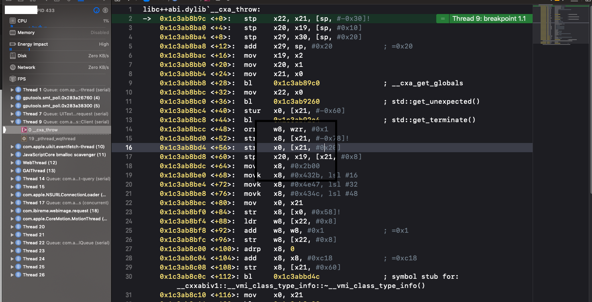

# Interview-Question

iOS 面试题积累 - iOS 篇2

### 索引

31. [Pod install & Pod update]()
32. [CocoaPods & Carhage & SPM（Swift Package Manager）]()
33. [有什么特别的BUG，如何调试，如何定位，开发环境及线上环境均谈一谈]()
34. [父类的静态方法能不能被子类重写]()
35. [OC中向nil对象发送消息会发生什么]()
36. [iOS中的nil、Nil、NULL、NSNull的区别]()
37. [Instrument调试性能]()
38. [MVC、MVP、MVVM、VIPER]()
39. [网络五层协议]()
40. [启动时间的监控和优化]()
41. [合理使用光栅化 shouldRasterize]()
42. [iOS 性能优化]()

------

### 31. Pod install & Pod update

- 使用pod install来安装新的库，即使你的工程里面已经有了Podfile，并且已经执行过pod install命令了；所以即使你是添加或移除库，都应该使用pod install。
- 使用pod update [PODNAME] 只有在你需要更新库到更新的版本时候用。
- 提交你的Podfile.lock文件

### 32. CocoaPods & Carhage & SPM（Swift Package Manager）

- CocoaPods优点
  - 使用方便，除编写 Podfile 以外其他几乎都是自动完成
  - 提供的三方框架数量巨大
  - 静态/动态编译均支持

- CocoaPods缺点

  - 每次更新环境都需要连接到中心仓库，比较耗时

  - 使用xcworkspace构建与产品绑定的pod项目，每次pod install/pod update/xcode clean（Podfile.lock发生改变）都会重新编译依赖文件，极大的影响项目编译速度

  - 为了兼容CocoaPods，框架作者有很多额外的工作

- Carthage优点
  - 与CocoaPods 无缝集成，方便项目迁移
  - 除了必要更新，不需要重复编译依赖文件
  - 不需要访问中心仓库获取配置，节省时间
  - 开发者为自己的框架添加Carthage支持异常简单（Xcode -> Project/Framework -> Set Scheme Shared）

- Carthage缺点
  - 仍有很多库尚未支持Carthage
  - 只支持动态库
  - 需要自行管理依赖的接入

- SPM

  Swift Package Manager业内简称为SPM，是苹果官方在Swift3.0时集成在系统里的第三方库管理工具（库），用它可以自动downloading、compiling和linking第三方库，使用起来也十分简洁高效，不过缺点是目前只支持mac OS。
  详见：https://swift.org/package-manager

### 33. 有什么特别的BUG，如何调试，如何定位，开发环境及线上环境均谈一谈

分享最近刚刚遇到的一个BUG：

iOS 13下，Debug模式，点击自定义的一个[LYWebViewController](https://github.com/DoTalkLily/LYWebViewController)就会Crash，Crash位置如上图。

根据方法调用栈，一开始以为是[LYWebViewController](https://github.com/DoTalkLily/LYWebViewController)与[YYWebImage](https://github.com/ibireme/YYWebImage)两个库中有一个有问题，

- 简单尝试过使用WKWebView替换LYWebViewController，Crash没有解决；
- 将YYWebImage从Pod引用修改为直接项目引用，注释掉YYWebImage奔溃线程中相应的代码，Crash依旧；
- 尝试Google：iOS 13、WebView、YYWebImage Crash，发现没有什么有用的结果；

- 调试中偶然发现，点击继续时，程序竟然可以照常运行，但是倒目前为止还是没找到头绪；
- Google报错信息，`libc++abi.dylib __cxa_throw:`，发现还是有挺多类似的[错误](https://www.jianshu.com/p/e0ffe982a064)，问题到此为止。

解决：

因为我们Xcode设置了全局异常断点，而且类型为all，所以c++的一些异常也会报错。而我们遇到的这个异常是C++异常，并且不影响正常程序运行，解决方法是把全局断点设置成objective-c类型。

### 34. 父类的静态方法能不能被子类重写

能。（因为我试过）

### 35. OC中向nil对象发送消息会发生什么

如果传递给 objc_msgSend 的 self 参数是 nil，该函数不会执行有意义的操作，直接返回。

因为OC的函数都是通过objc_msgSend进行消息发送来实现的，相对于C和C++来说，对于空指针的操作会引起crash问题，而objc_msgSend会通过判断self来决定是否发送消息，如果self为nil，那么selector也会为空，直接返回，不会出现问题。视方法返回值，向nil发消息可能会返回nil（返回值为对象），0（返回值为一些基础数据）或 返回值为结构体，发送给 nil 的消息将返回0，结构体中各个字段的值将都是0，等等。但对于[NSNull null]对象发送消息时，是会crash的，因为NSNull类只有一个null方法。

### 36. iOS中的nil、Nil、NULL、NSNull的区别

1. nil，定义一个空的实例，指向OC中对象的空指针。
2. NULL，NULL可以用在C语言的各种指针上。
3. Nil，定义一个空的类。
4. NSNull，NSNull是一个类，它定义了一个单例对象用于表示集合对象的空值。

### 37. Instrument调试性能

1. Leaks内存泄漏检测：参考https://www.wangquanwei.com/63.html

2. Time Profiler：监控耗时的方法

3. Core Animation：随着我们操作 App 界面，就可以看到帧率的变化和数据

   Debug Option：

   - `Color Blended Layers`，这个选项选项基于渲染程度对屏幕中的混合区域进行绿到红的高亮显示，**越红表示性能越差**，会对帧率等指标造成较大的影响。红色通常是由于多个半透明图层叠加引起。
   - `Color Hits Green and Misses Red`，当 `UIView.layer.shouldRasterize = YES` 时，耗时的图片绘制会被缓存，并当做一个简单的扁平图片来呈现。这时候，如果页面的其他区块(比如 UITableViewCell 的复用)使用缓存直接命中，就显示绿色，反之，如果不命中，这时就显示红色。**红色越多，性能越差。**因为栅格化生成缓存的过程是有开销的，如果缓存能被大量命中和有效使用，则总体上会降低开销，反之则意味着要频繁生成新的缓存，这会让性能问题雪上加霜。
   - `Color Copied Images`，对于 GPU 不支持的色彩格式的图片只能由 CPU 来处理，把这样的图片标为蓝色。**蓝色越多，性能越差。**因为，我们不希望在滚动视图的时候，由 CPU 来处理图片，这样可能会对主线程造成阻塞。
   - `Color Immediately`，通常 Core Animation Instruments 以每毫秒 10 次的频率更新图层调试颜色。对某些效果来说，这显然太慢了。这个选项就可以用来设置每帧都更新（可能会影响到渲染性能，而且会导致帧率测量不准，所以不要一直都设置它）。
   - `Color Misaligned Images`，这个选项检查了图片是否被缩放，以及像素是否对齐。被放缩的图片会被标记为黄色，像素不对齐则会标注为紫色。**黄色、紫色越多，性能越差。**
   - `Color Offscreen-Rendered Yellow`，这个选项会把那些离屏渲染的图层显示为黄色。**黄色越多，性能越差。**这些显示为黄色的图层很可能需要用 shadowPath 或者 shouldRasterize 来优化。
   - `Color OpenGL Fast Path Blue`，这个选项会把任何直接使用 OpenGL 绘制的图层显示为蓝色。**蓝色越多，性能越好。**如果仅仅使用 UIKit 或者 Core Animation 的 API，那么不会有任何效果。如果使用 GLKView 或者 CAEAGLLayer，那如果不显示蓝色块的话就意味着你正在强制 CPU 渲染额外的纹理，而不是绘制到屏幕。
   - `Flash Updated Regions`，这个选项会把重绘的内容显示为黄色。**不该出现的黄色越多，性能越差。**通常我们希望只是更新的部分被标记完黄色。

4. 我们还可以使用 `Activity Monitor`、`Allocations`、`Zombies` 等模板来针对性地做内存监测。

### 38. MVC、MVP、MVVM、VIPER

1. MVC

   iOS里面的viewcontroller其实是view和controller的组合，目的就是为了提高开发效率，简化操作。

   简单界面来说，viewcontroller结构确实可以提高开发效率，但是一旦需要构建复杂界面，那么viewcontroller很容易就会出现代码膨胀，逻辑满天飞的问题，导致Massive Controller的出现。

   iOS中各层的作用：

   - Controller
     - 生成view，然后组装view
     - 响应View的事件和作为view的代理
     - 调用model的数据获取接口，拿到返回数据，处理加工，渲染到view显示
     - 处理view的生命周期
     - 处理界面之间的跳转

   - model
     - 业务逻辑封装
     - 提供数据接口给controller使用
     - 数据持久化存储和读取
     - 作为数据模型存储数据

   - view
     - 界面元素搭建，动画效果，数据展示，
     - 接受用户操作并反馈视觉效果

2. MVP

   MVC的缺点在于并没有区分业务逻辑和业务展示, 这对单元测试很不友好. MVP针对以上缺点做了优化, 它将业务逻辑和业务展示也做了一层隔离, 对应的就变成了MVCP. M和V功能不变, 原来的C现在只负责布局, 而所有的逻辑全都转移到了P层.

   在 MVP 中，Presenter 可以理解为松散的控制器，其中包含了视图的 UI 业务逻辑，所有从视图发出的事件，都会通过代理给 Presenter 进行处理；同时，Presenter 也通过视图暴露的接口与其进行通信。

   各层的作用：

   - VC层
     - view的布局和组装
     - view的生命周期控制
     - 通知各个P层去获取数据然后渲染到view上面展示

   - controller层
     - 生成view，实现view的代理和数据源
     - 绑定view和presenter
     - 调用presenter执行业务逻辑

   - model层
     - 和MVC的model层类似

   - view层
     - 监听P层的数据更新通知, 刷新页面展示.（MVC里由C层负责）
     - 在点击事件触发时, 调用P层的对应方法, 并对方法执行结果进行展示.（MVC里由C层负责）
     - 界面元素布局和动画
     - 反馈用户操作

   - Presenter层
     - 实现view的事件处理逻辑，暴露相应的接口给view的事件调用
     - 调用model的接口获取数据，然后加工数据，封装成view可以直接用来显示的数据和状态
     - 处理界面之间的跳转（这个根据实际情况来确定放在P还是C）

   MVP相对于MVC, 它其实只做了一件事情, 即分割业务展示和业务逻辑. 展示和逻辑分开后, 只要我们能保证V在收到P的数据更新通知后能正常刷新页面, 那么整个业务就没有问题. 因为V收到的通知其实都是来自于P层的数据获取/更新操作, 所以我们只要保证P层的这些操作都是正常的就可以了. 即我们只用测试P层的逻辑, 不必关心V层的情况.

3. MVVM

   MVVM其实只是MVP的绑定进化体, 除去数据绑定方式, 其他的和MVP如出一辙, 只是可能呈现方式是Command/Signal而不是CompletionHandler之类的, 故不做赘述.

>总结：
>
>1.MVC作为老牌架构, 优点在于将业务场景按展示数据类型划分出多个模块, 每个模块中的C层负责业务逻辑和业务展示, 而M和V应该是互相隔离的以做重用, 另外每个模块处理得当也可以作为重用单元. 拆分在于解耦, 顺便做了减负, 隔离在于重用, 提升开发效率. 缺点是没有区分业务逻辑和业务展示, 对单元测试不友好.
>2.MVP作为MVC的进阶版, 提出区分业务逻辑和业务展示, 将所有的业务逻辑转移到P层, V层接受P层的数据更新通知进行页面展示. 优点在于良好的分层带来了友好的单元测试, 缺点在于分层会让代码逻辑优点绕, 同时也带来了大量的代码工作, 对程序员不够友好.
>3.MVVM作为集大成者, 通过数据绑定做数据更新, 减少了大量的代码工作, 同时优化了代码逻辑, 只是学习成本有点高, 对新手不够友好.
>4.MVP和MVVM因为分层所以会建立MVC两倍以上的文件类, 需要良好的代码管理方式.
>5.在MVP和MVVM中, V和P或者VM之间理论上是多对多的关系, 不同的布局在相同的逻辑下只需要替换V层, 而相同的布局不同的逻辑只需要替换P或者VM层. 但实际开发中P或者VM往往因为耦合了V层的展示逻辑退化成了一对一关系(比如SceneA中需要显示"xxx+Name", VM就将Name格式化为"xxx + Name". 某一天SceneB也用到这个模块, 所有的点击事件和页面展示都一样, 只是Name展示为"yyy + Name", 此时的VM因为耦合SceneA的展示逻辑, 就显得比较尴尬), 针对此类情况, 通常有两种办法, 一种是在VM层加状态进而判断输出状态, 一种是在VM层外再加一层FormatHelper. 前者可能因为状态过多显得代码难看, 后者虽然比较优雅且拓展性高, 但是过多的分层在数据还原时就略显笨拙, 大家应该按需选择.

以上内容参考自：[杂谈: MVC/MVP/MVVM](https://www.jianshu.com/p/eedbc820d40a)

在应用架构这块，每个人理解的都不太一样，我觉得我们要做的，就是在充分理解概念的情况下，如何运用正确的方式，根据自己的业务场景去更好的组织代码。

最后贴几篇文章：

[iOS应用架构谈 view层的组织和调用方案](https://casatwy.com/iosying-yong-jia-gou-tan-viewceng-de-zu-zhi-he-diao-yong-fang-an.html)

[论MVVM伪框架结构和MVC中M的实现机制](https://www.jianshu.com/p/33c7e2f3a613)

### 39. 网络五层协议

OSI七层协议模型主要是：应用层（Application）、表示层（Presentation）、会话层（Session）、传输层（Transport）、网络层（Network）、数据链路层（Data Link）、物理层（Physical）。

五层体系结构包括：应用层、运输层、网络层、数据链路层和物理层。 

1. 第五层——应用层(application layer) 

- **应用层(application layer)：**是体系结构中的最高。直接为用户的应用进程（例如电子邮件、文件传输和终端仿真）提供服务。
- 在因特网中的应用层协议很多，如支持万维网应用的HTTP协议，支持电子邮件的SMTP协议，支持文件传送的FTP协议，DNS，POP3，SNMP，Telnet等等。

2. 第四层——运输层(transport layer)

- **运输层(transport layer)：**负责向两个主机中进程之间的通信提供服务。由于一个主机可同时运行多个进程，因此运输层有复用和分用的功能
- 复用，就是多个应用层进程可同时使用下面运输层的服务。
- 分用，就是把收到的信息分别交付给上面应用层中相应的进程。
- **运输层主要使用以下两种协议：** 
  **(1) 传输控制协议TCP(Transmission Control Protocol)：**面向连接的，数据传输的单位是报文段，能够提供可靠的交付。 
  **(2) 用户数据包协议UDP(User Datagram Protocol)：**无连接的，数据传输的单位是用户数据报，不保证提供可靠的交付，只能提供“尽最大努力交付”。

3.  第三层——网络层(network layer)

- **网络层(network layer)主要包括以下两个任务：**
- **(1) 负责为分组交换网上的不同主机提供通信服务。在发送数据时，网络层把运输层产生的报文段或用户数据报封装成分组或包进行传送。在TCP/IP体系中，由于网络层使用IP协议，因此分组也叫做IP数据报，或简称为数据报。**
- **(2) 选中合适的路由，使源主机运输层所传下来的分组，能够通过网络中的路由器找到目的主机。**
- **协议：IP,ICMP,IGMP,ARP,RARP**

4. 第二层——数据链路层(data link layer)

- **数据链路层(data link layer)：**常简称为链路层，我们知道，两个主机之间的数据传输，总是在一段一段的链路上传送的，也就是说，在两个相邻结点之间传送数据是直接传送的(点对点)，这时就需要使用专门的链路层的协议。
- 在两个相邻结点之间传送数据时，数据链路层将网络层交下来的IP数据报组装成帧(framing)，在两个相邻结点之间的链路上“透明”地传送帧中的数据。
- 每一帧包括数据和必要的控制信息(如同步信息、地址信息、差错控制等)。典型的帧长是几百字节到一千多字节。
- 注：”透明”是一个很重要的术语。它表示，某一个实际存在的事物看起来却好像不存在一样。”在数据链路层透明传送数据”表示无力什么样的比特组合的数据都能够通过这个数据链路层。因此，对所传送的数据来说，这些数据就“看不见”数据链路层。或者说，数据链路层对这些数据来说是透明的。 
  (1)在接收数据时，控制信息使接收端能知道一个帧从哪个比特开始和到哪个比特结束。这样，数据链路层在收到一个帧后，就可从中提取出数据部分，上交给网络层。 
  (2)控制信息还使接收端能检测到所收到的帧中有无差错。如发现有差错，数据链路层就简单地丢弃这个出了差错的帧，以免继续传送下去白白浪费网络资源。如需改正错误，就由运输层的TCP协议来完成。

5. 第一层——物理层(physical layer)

- **物理层(physical layer)：**在物理层上所传数据的单位是比特。物理层的任务就是透明地传送比特流。

### 40. 启动时间的监控和优化

t(App总启动时间) = t1(main()之前的加载时间) + t2(main()之后的加载时间)。 t1 = 系统dylib(动态链接库)和自身App可执行文件的加载； 
t2 = main方法执行之后到AppDelegate类中的- `(BOOL)Application:(UIApplication *)Application didFinishLaunchingWithOptions:(NSDictionary *)launchOptions`方法执行结束前这段时间，主要是构建第一个界面，并完成渲染展示。

- 对于main()调用之前的耗时我们可以优化的点有：

1. 减少不必要的framework，因为动态链接比较耗时

2. check framework应当设为optional和required，如果该framework在当前App支持的所有iOS系统版本都存在，那么就设为required，否则就设为optional，因为optional会有些额外的检查

3. 合并或者删减一些OC类，关于清理项目中没用到的类，使用工具AppCode代码检查功能，查到当前项目中没有用到的类如下：

   - 删减一些无用的静态变量

   - 删减没有被调用到或者已经废弃的方法
   - 将不必须在+load方法中做的事情延迟到+initialize中
   - 尽量不要用C++虚函数(创建虚函数表有开销)

- main()调用之后的优化

1. 纯代码方式而不是storyboard加载首页UI。
2. 对didFinishLaunching里的函数考虑能否挖掘可以延迟加载或者懒加载，需要与各个业务方pm和rd共同check 对于一些已经下线的业务，删减冗余代码。 
   对于一些与UI展示无关的业务，如微博认证过期检查、图片最大缓存空间设置等做延迟加载
3. 对实现了+load()方法的类进行分析，尽量将load里的代码延后调用。
4. 上面统计数据显示展示feed的导航控制器页面(NewsListViewController)比较耗时，对于viewDidLoad以及viewWillAppear方法中尽量去尝试少做，晚做，不做。

### 41. 合理使用光栅化 shouldRasterize

光栅化是把`GPU`的操作转到`CPU`上，生成位图缓存，直接读取复用。

##### 优点：

- `CALayer`会被光栅化为`bitmap`，`shadows`、`cornerRadius`等效果会被缓存。

##### 缺点：

- 更新已经光栅化的`layer`，会造成离屏渲染。
- `bitmap`超过`100ms`没有使用就会移除。
- 受系统限制，缓存的大小为 2.5X Screen Size。

**shouldRasterize适合静态页面显示，动态页面会增加开销。如果设置了shouldRasterize为 YES，那也要记住设置rasterizationScale为contentsScale。**

### 42. iOS 性能优化

- NSDateFormatter
- 启动时间优化，参考40
- Instrument：Time Profiler、CoreAnimation（Color Blended Layers、Color Misaligned Images、Color Offscreen-Rendered Yellow）
- 减少透明 view
- 不要动态创建视图
- 异步渲染
- 离屏渲染的优化建议
  - 使用`ShadowPath`指定`layer`阴影效果路径。
  - 使用异步进行`layer`渲染（`Facebook`开源的异步绘制框架`AsyncDisplayKit`）。
  - 设置`layer`的`opaque`值为`YES`，减少复杂图层合成。
  - 尽量使用不包含透明（`alpha`）通道的图片资源。
  - 尽量设置`layer`的大小值为整形值。
  - 直接让美工把图片切成圆角进行显示，这是效率最高的一种方案。
  - 很多情况下用户上传图片进行显示，可以在客户端处理圆角。
  - 使用代码手动生成圆角`image`设置到要显示的`View`上，利用`UIBezierPath`（`Core Graphics`框架）画出来圆角图片。

参考：[iOS 性能优化总结](https://juejin.im/post/5ace078cf265da23994ee493)

--------

待补充：

2. UITableView 卡顿的原因，如何优化
3. 有什么特别的BUG，如何调试，如何定位，开发环境及线上环境均谈一谈
5. 二叉树，给出两个子节点，快速找到最小父节点
6. iOS 性能优化做了哪些尝试
9. MVC、MVP、MVVM
7. 启动时间监控和优化