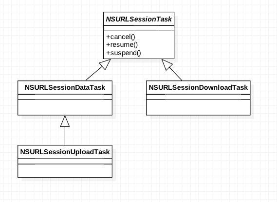
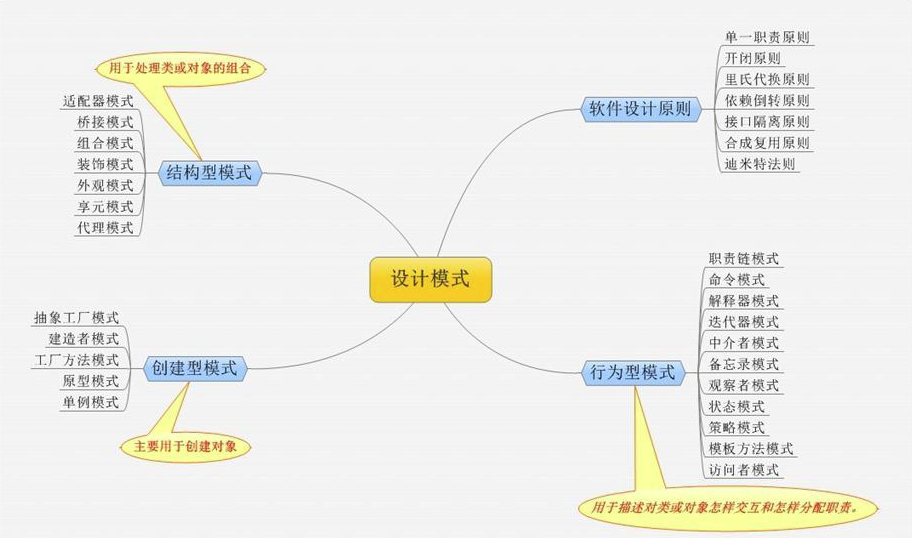
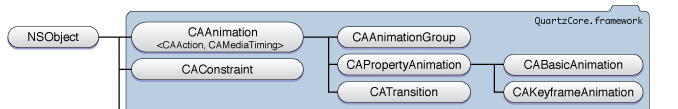

# Interview-Question

iOS 面试题积累 - iOS 篇2

### 索引

31. [Pod install & Pod update](./interview-questions2.md#31-pod-install--pod-update)
32. [CocoaPods & Carhage & SPM（Swift Package Manager）](./interview-questions2.md#32-cocoapods--carhage--spmswift-package-manager)
33. [有什么特别的BUG，如何调试，如何定位，开发环境及线上环境均谈一谈](./interview-questions2.md#33-有什么特别的bug如何调试如何定位开发环境及线上环境均谈一谈)
34. [父类的静态方法能不能被子类重写](./interview-questions2.md#34-父类的静态方法能不能被子类重写)
35. [OC中向nil对象发送消息会发生什么](./interview-questions2.md#35-oc中向nil对象发送消息会发生什么)
36. [iOS中的nil、Nil、NULL、NSNull的区别](./interview-questions2.md#36-ios中的nilnilnullnsnull的区别)
37. [Instrument调试性能](./interview-questions2.md#37-instrument调试性能)
38. [MVC、MVP、MVVM、VIPER](./interview-questions2.md#38-mvcmvpmvvmviper)
39. [网络五层协议](./interview-questions2.md#39-网络五层协议)
40. [启动时间的监控和优化](./interview-questions2.md#40-启动时间的监控和优化)
41. [合理使用光栅化 shouldRasterize](./interview-questions2.md#41-合理使用光栅化-shouldrasterize)
42. [iOS 性能优化](./interview-questions2.md#42-ios-性能优化)
43. [id 和 void*](./interview-questions2.md#43-id-和-void)
44. [LinkMap](./interview-questions2.md#44-linkmap)
45. [dSYM文件](./interview-questions2.md#45-dsym文件)
46. [RAC（ReactiveCocoa）的冷信号、热信号](./interview-questions2.md#46-racreactivecocoa的冷信号热信号)
47. [单例、饿汉式、懒汉式](./interview-questions2.md#47-单例饿汉式懒汉式)
48. [Runtime、isa、imp](./interview-questions2.md#48-runtimeisaimp)
49. [Method Swizzling 会造成什么问题](./interview-questions2.md#49-method-swizzling-会造成什么问题)
50. [iOS中的hash](./interview-questions2.md#49-method-swizzling-会造成什么问题)
51. [内存分区](./interview-questions2.md#51-内存分区)
52. [__block](./interview-questions2.md#52-__block)
53. [ViewController 生命周期](./interview-questions2.md#53-viewcontroller-生命周期)
54. [HTTP协议](./interview-questions2.md#54-http协议)
55. [Swift、OC比较](./interview-questions2.md#55-swiftoc比较)
56. [AFNetworking 2.0 与 3.0 版本有什么区别](./interview-questions2.md#56-afnetworking-20-与-30-版本有什么区别)
57. [NSURLSession](./interview-questions2.md#57-nsurlsession)
58. [离屏渲染](./interview-questions2.md#58-离屏渲染)
59. [设计模式](./interview-questions2.md#59-设计模式)
60. [动画](./interview-questions2.md#60-动画)

------

### 31. Pod install & Pod update

- 使用pod install来安装新的库，即使你的工程里面已经有了Podfile，并且已经执行过pod install命令了；所以即使你是添加或移除库，都应该使用pod install。
- 使用pod update [PODNAME] 只有在你需要更新库到更新的版本时候用。
- 提交你的Podfile.lock文件

### 32. CocoaPods & Carhage & SPM（Swift Package Manager）

- CocoaPods优点
  - 使用方便，除编写 Podfile 以外其他几乎都是自动完成
  - 提供的三方框架数量巨大
  - 静态/动态编译均支持

- CocoaPods缺点

  - 每次更新环境都需要连接到中心仓库，比较耗时

  - 使用xcworkspace构建与产品绑定的pod项目，每次pod install/pod update/xcode clean（Podfile.lock发生改变）都会重新编译依赖文件，极大的影响项目编译速度

  - 为了兼容CocoaPods，框架作者有很多额外的工作

- Carthage优点
  - 与CocoaPods 无缝集成，方便项目迁移
  - 除了必要更新，不需要重复编译依赖文件
  - 不需要访问中心仓库获取配置，节省时间
  - 开发者为自己的框架添加Carthage支持异常简单（Xcode -> Project/Framework -> Set Scheme Shared）

- Carthage缺点
  - 仍有很多库尚未支持Carthage
  - 只支持动态库
  - 需要自行管理依赖的接入

- SPM

  Swift Package Manager业内简称为SPM，是苹果官方在Swift3.0时集成在系统里的第三方库管理工具（库），用它可以自动downloading、compiling和linking第三方库，使用起来也十分简洁高效，不过缺点是目前只支持mac OS。
  详见：https://swift.org/package-manager

### 33. 有什么特别的BUG，如何调试，如何定位，开发环境及线上环境均谈一谈

分享最近刚刚遇到的一个BUG：


iOS 13下，Debug模式，点击自定义的一个[LYWebViewController](https://github.com/DoTalkLily/LYWebViewController)就会Crash，Crash位置如上图。

根据方法调用栈，一开始以为是[LYWebViewController](https://github.com/DoTalkLily/LYWebViewController)与[YYWebImage](https://github.com/ibireme/YYWebImage)两个库中有一个有问题，

- 简单尝试过使用WKWebView替换LYWebViewController，Crash没有解决；
- 将YYWebImage从Pod引用修改为直接项目引用，注释掉YYWebImage奔溃线程中相应的代码，Crash依旧；
- 尝试Google：iOS 13、WebView、YYWebImage Crash，发现没有什么有用的结果；

- 调试中偶然发现，点击继续时，程序竟然可以照常运行，但是倒目前为止还是没找到头绪；
- Google报错信息，`libc++abi.dylib __cxa_throw:`，发现还是有挺多类似的[错误](https://www.jianshu.com/p/e0ffe982a064)，问题到此为止。

解决：

因为我们Xcode设置了全局异常断点，而且类型为all，所以c++的一些异常也会报错。而我们遇到的这个异常是C++异常，并且不影响正常程序运行，解决方法是把全局断点设置成objective-c类型。

### 34. 父类的静态方法能不能被子类重写

能。（因为我试过）

### 35. OC中向nil对象发送消息会发生什么

如果传递给 objc_msgSend 的 self 参数是 nil，该函数不会执行有意义的操作，直接返回。

因为OC的函数都是通过objc_msgSend进行消息发送来实现的，相对于C和C++来说，对于空指针的操作会引起crash问题，而objc_msgSend会通过判断self来决定是否发送消息，如果self为nil，那么selector也会为空，直接返回，不会出现问题。视方法返回值，向nil发消息可能会返回nil（返回值为对象），0（返回值为一些基础数据）或 返回值为结构体，发送给 nil 的消息将返回0，结构体中各个字段的值将都是0，等等。但对于[NSNull null]对象发送消息时，是会crash的，因为NSNull类只有一个null方法。

### 36. iOS中的nil、Nil、NULL、NSNull的区别

1. nil，定义一个空的实例，指向OC中对象的空指针。
2. NULL，NULL可以用在C语言的各种指针上。
3. Nil，定义一个空的类。
4. NSNull，NSNull是一个类，它定义了一个单例对象用于表示集合对象的空值。

### 37. Instrument调试性能

1. Leaks内存泄漏检测：参考https://www.wangquanwei.com/63.html

2. Time Profiler：监控耗时的方法

3. Core Animation：随着我们操作 App 界面，就可以看到帧率的变化和数据

   Debug Option：

   - `Color Blended Layers`，这个选项选项基于渲染程度对屏幕中的混合区域进行绿到红的高亮显示，**越红表示性能越差**，会对帧率等指标造成较大的影响。红色通常是由于多个半透明图层叠加引起。
   - `Color Hits Green and Misses Red`，当 `UIView.layer.shouldRasterize = YES` 时，耗时的图片绘制会被缓存，并当做一个简单的扁平图片来呈现。这时候，如果页面的其他区块(比如 UITableViewCell 的复用)使用缓存直接命中，就显示绿色，反之，如果不命中，这时就显示红色。**红色越多，性能越差。**因为栅格化生成缓存的过程是有开销的，如果缓存能被大量命中和有效使用，则总体上会降低开销，反之则意味着要频繁生成新的缓存，这会让性能问题雪上加霜。
   - `Color Copied Images`，对于 GPU 不支持的色彩格式的图片只能由 CPU 来处理，把这样的图片标为蓝色。**蓝色越多，性能越差。**因为，我们不希望在滚动视图的时候，由 CPU 来处理图片，这样可能会对主线程造成阻塞。
   - `Color Immediately`，通常 Core Animation Instruments 以每毫秒 10 次的频率更新图层调试颜色。对某些效果来说，这显然太慢了。这个选项就可以用来设置每帧都更新（可能会影响到渲染性能，而且会导致帧率测量不准，所以不要一直都设置它）。
   - `Color Misaligned Images`，这个选项检查了图片是否被缩放，以及像素是否对齐。被放缩的图片会被标记为黄色，像素不对齐则会标注为紫色。**黄色、紫色越多，性能越差。**
   - `Color Offscreen-Rendered Yellow`，这个选项会把那些离屏渲染的图层显示为黄色。**黄色越多，性能越差。**这些显示为黄色的图层很可能需要用 shadowPath 或者 shouldRasterize 来优化。
   - `Color OpenGL Fast Path Blue`，这个选项会把任何直接使用 OpenGL 绘制的图层显示为蓝色。**蓝色越多，性能越好。**如果仅仅使用 UIKit 或者 Core Animation 的 API，那么不会有任何效果。如果使用 GLKView 或者 CAEAGLLayer，那如果不显示蓝色块的话就意味着你正在强制 CPU 渲染额外的纹理，而不是绘制到屏幕。
   - `Flash Updated Regions`，这个选项会把重绘的内容显示为黄色。**不该出现的黄色越多，性能越差。**通常我们希望只是更新的部分被标记完黄色。

4. 我们还可以使用 `Activity Monitor`、`Allocations`、`Zombies` 等模板来针对性地做内存监测。

### 38. MVC、MVP、MVVM、VIPER

1. MVC

   iOS里面的viewcontroller其实是view和controller的组合，目的就是为了提高开发效率，简化操作。

   简单界面来说，viewcontroller结构确实可以提高开发效率，但是一旦需要构建复杂界面，那么viewcontroller很容易就会出现代码膨胀，逻辑满天飞的问题，导致Massive Controller的出现。

   iOS中各层的作用：

   - Controller
     - 生成view，然后组装view
     - 响应View的事件和作为view的代理
     - 调用model的数据获取接口，拿到返回数据，处理加工，渲染到view显示
     - 处理view的生命周期
     - 处理界面之间的跳转

   - model
     - 业务逻辑封装
     - 提供数据接口给controller使用
     - 数据持久化存储和读取
     - 作为数据模型存储数据

   - view
     - 界面元素搭建，动画效果，数据展示，
     - 接受用户操作并反馈视觉效果

2. MVP

   MVC的缺点在于并没有区分业务逻辑和业务展示, 这对单元测试很不友好. MVP针对以上缺点做了优化, 它将业务逻辑和业务展示也做了一层隔离, 对应的就变成了MVCP. M和V功能不变, 原来的C现在只负责布局, 而所有的逻辑全都转移到了P层.

   在 MVP 中，Presenter 可以理解为松散的控制器，其中包含了视图的 UI 业务逻辑，所有从视图发出的事件，都会通过代理给 Presenter 进行处理；同时，Presenter 也通过视图暴露的接口与其进行通信。

   各层的作用：

   - VC层
     - view的布局和组装
     - view的生命周期控制
     - 通知各个P层去获取数据然后渲染到view上面展示

   - controller层
     - 生成view，实现view的代理和数据源
     - 绑定view和presenter
     - 调用presenter执行业务逻辑

   - model层
     - 和MVC的model层类似

   - view层
     - 监听P层的数据更新通知, 刷新页面展示.（MVC里由C层负责）
     - 在点击事件触发时, 调用P层的对应方法, 并对方法执行结果进行展示.（MVC里由C层负责）
     - 界面元素布局和动画
     - 反馈用户操作

   - Presenter层
     - 实现view的事件处理逻辑，暴露相应的接口给view的事件调用
     - 调用model的接口获取数据，然后加工数据，封装成view可以直接用来显示的数据和状态
     - 处理界面之间的跳转（这个根据实际情况来确定放在P还是C）

   MVP相对于MVC, 它其实只做了一件事情, 即分割业务展示和业务逻辑. 展示和逻辑分开后, 只要我们能保证V在收到P的数据更新通知后能正常刷新页面, 那么整个业务就没有问题. 因为V收到的通知其实都是来自于P层的数据获取/更新操作, 所以我们只要保证P层的这些操作都是正常的就可以了. 即我们只用测试P层的逻辑, 不必关心V层的情况.

3. MVVM

   MVVM其实只是MVP的绑定进化体, 除去数据绑定方式, 其他的和MVP如出一辙, 只是可能呈现方式是Command/Signal而不是CompletionHandler之类的, 故不做赘述.

>总结：
>
>1.MVC作为老牌架构, 优点在于将业务场景按展示数据类型划分出多个模块, 每个模块中的C层负责业务逻辑和业务展示, 而M和V应该是互相隔离的以做重用, 另外每个模块处理得当也可以作为重用单元. 拆分在于解耦, 顺便做了减负, 隔离在于重用, 提升开发效率. 缺点是没有区分业务逻辑和业务展示, 对单元测试不友好.
>2.MVP作为MVC的进阶版, 提出区分业务逻辑和业务展示, 将所有的业务逻辑转移到P层, V层接受P层的数据更新通知进行页面展示. 优点在于良好的分层带来了友好的单元测试, 缺点在于分层会让代码逻辑优点绕, 同时也带来了大量的代码工作, 对程序员不够友好.
>3.MVVM作为集大成者, 通过数据绑定做数据更新, 减少了大量的代码工作, 同时优化了代码逻辑, 只是学习成本有点高, 对新手不够友好.
>4.MVP和MVVM因为分层所以会建立MVC两倍以上的文件类, 需要良好的代码管理方式.
>5.在MVP和MVVM中, V和P或者VM之间理论上是多对多的关系, 不同的布局在相同的逻辑下只需要替换V层, 而相同的布局不同的逻辑只需要替换P或者VM层. 但实际开发中P或者VM往往因为耦合了V层的展示逻辑退化成了一对一关系(比如SceneA中需要显示"xxx+Name", VM就将Name格式化为"xxx + Name". 某一天SceneB也用到这个模块, 所有的点击事件和页面展示都一样, 只是Name展示为"yyy + Name", 此时的VM因为耦合SceneA的展示逻辑, 就显得比较尴尬), 针对此类情况, 通常有两种办法, 一种是在VM层加状态进而判断输出状态, 一种是在VM层外再加一层FormatHelper. 前者可能因为状态过多显得代码难看, 后者虽然比较优雅且拓展性高, 但是过多的分层在数据还原时就略显笨拙, 大家应该按需选择.

以上内容参考自：[杂谈: MVC/MVP/MVVM](https://www.jianshu.com/p/eedbc820d40a)

在应用架构这块，每个人理解的都不太一样，我觉得我们要做的，就是在充分理解概念的情况下，如何运用正确的方式，根据自己的业务场景去更好的组织代码。

最后贴几篇文章：

[iOS应用架构谈 view层的组织和调用方案](https://casatwy.com/iosying-yong-jia-gou-tan-viewceng-de-zu-zhi-he-diao-yong-fang-an.html)

[论MVVM伪框架结构和MVC中M的实现机制](https://www.jianshu.com/p/33c7e2f3a613)

[iOS VIPER架构实践(一)：从MVC到MVVM到VIPER](https://www.jianshu.com/p/8418fba98e1a)

[浅谈 MVC、MVP 和 MVVM 架构模式](https://draveness.me/mvx.html)

### 39. 网络五层协议

OSI七层协议模型主要是：应用层（Application）、表示层（Presentation）、会话层（Session）、传输层（Transport）、网络层（Network）、数据链路层（Data Link）、物理层（Physical）。

五层体系结构包括：应用层、运输层、网络层、数据链路层和物理层。 

1. 第五层——应用层(application layer) 

- **应用层(application layer)：**是体系结构中的最高。直接为用户的应用进程（例如电子邮件、文件传输和终端仿真）提供服务。
- 在因特网中的应用层协议很多，如支持万维网应用的HTTP协议，支持电子邮件的SMTP协议，支持文件传送的FTP协议，DNS，POP3，SNMP，Telnet等等。

2. 第四层——运输层(transport layer)

- **运输层(transport layer)：**负责向两个主机中进程之间的通信提供服务。由于一个主机可同时运行多个进程，因此运输层有复用和分用的功能
- 复用，就是多个应用层进程可同时使用下面运输层的服务。
- 分用，就是把收到的信息分别交付给上面应用层中相应的进程。
- **运输层主要使用以下两种协议：** 
  **(1) 传输控制协议TCP(Transmission Control Protocol)：**面向连接的，数据传输的单位是报文段，能够提供可靠的交付。 
  **(2) 用户数据包协议UDP(User Datagram Protocol)：**无连接的，数据传输的单位是用户数据报，不保证提供可靠的交付，只能提供“尽最大努力交付”。

3.  第三层——网络层(network layer)

- **网络层(network layer)主要包括以下两个任务：**
- **(1) 负责为分组交换网上的不同主机提供通信服务。在发送数据时，网络层把运输层产生的报文段或用户数据报封装成分组或包进行传送。在TCP/IP体系中，由于网络层使用IP协议，因此分组也叫做IP数据报，或简称为数据报。**
- **(2) 选中合适的路由，使源主机运输层所传下来的分组，能够通过网络中的路由器找到目的主机。**
- **协议：IP,ICMP,IGMP,ARP,RARP**

4. 第二层——数据链路层(data link layer)

- **数据链路层(data link layer)：**常简称为链路层，我们知道，两个主机之间的数据传输，总是在一段一段的链路上传送的，也就是说，在两个相邻结点之间传送数据是直接传送的(点对点)，这时就需要使用专门的链路层的协议。
- 在两个相邻结点之间传送数据时，数据链路层将网络层交下来的IP数据报组装成帧(framing)，在两个相邻结点之间的链路上“透明”地传送帧中的数据。
- 每一帧包括数据和必要的控制信息(如同步信息、地址信息、差错控制等)。典型的帧长是几百字节到一千多字节。
- 注：”透明”是一个很重要的术语。它表示，某一个实际存在的事物看起来却好像不存在一样。”在数据链路层透明传送数据”表示无力什么样的比特组合的数据都能够通过这个数据链路层。因此，对所传送的数据来说，这些数据就“看不见”数据链路层。或者说，数据链路层对这些数据来说是透明的。 
  (1)在接收数据时，控制信息使接收端能知道一个帧从哪个比特开始和到哪个比特结束。这样，数据链路层在收到一个帧后，就可从中提取出数据部分，上交给网络层。 
  (2)控制信息还使接收端能检测到所收到的帧中有无差错。如发现有差错，数据链路层就简单地丢弃这个出了差错的帧，以免继续传送下去白白浪费网络资源。如需改正错误，就由运输层的TCP协议来完成。

5. 第一层——物理层(physical layer)

- **物理层(physical layer)：**在物理层上所传数据的单位是比特。物理层的任务就是透明地传送比特流。

### 40. 启动时间的监控和优化

t(App总启动时间) = t1(main()之前的加载时间) + t2(main()之后的加载时间)。 t1 = 系统dylib(动态链接库)和自身App可执行文件的加载； 
t2 = main方法执行之后到AppDelegate类中的- `(BOOL)Application:(UIApplication *)Application didFinishLaunchingWithOptions:(NSDictionary *)launchOptions`方法执行结束前这段时间，主要是构建第一个界面，并完成渲染展示。

- 对于main()调用之前的耗时我们可以优化的点有：

1. 减少不必要的framework，因为动态链接比较耗时

2. check framework应当设为optional和required，如果该framework在当前App支持的所有iOS系统版本都存在，那么就设为required，否则就设为optional，因为optional会有些额外的检查

3. 合并或者删减一些OC类，关于清理项目中没用到的类，使用工具AppCode代码检查功能，查到当前项目中没有用到的类如下：

   - 删减一些无用的静态变量

   - 删减没有被调用到或者已经废弃的方法
   - 将不必须在+load方法中做的事情延迟到+initialize中
   - 尽量不要用C++虚函数(创建虚函数表有开销)

- main()调用之后的优化

1. 纯代码方式而不是storyboard加载首页UI。
2. 对didFinishLaunching里的函数考虑能否挖掘可以延迟加载或者懒加载，需要与各个业务方pm和rd共同check 对于一些已经下线的业务，删减冗余代码。 
   对于一些与UI展示无关的业务，如微博认证过期检查、图片最大缓存空间设置等做延迟加载
3. 对实现了+load()方法的类进行分析，尽量将load里的代码延后调用。
4. 上面统计数据显示展示feed的导航控制器页面(NewsListViewController)比较耗时，对于viewDidLoad以及viewWillAppear方法中尽量去尝试少做，晚做，不做。

### 41. 合理使用光栅化 shouldRasterize

光栅化是把`GPU`的操作转到`CPU`上，生成位图缓存，直接读取复用。

##### 优点：

- `CALayer`会被光栅化为`bitmap`，`shadows`、`cornerRadius`等效果会被缓存。

##### 缺点：

- 更新已经光栅化的`layer`，会造成离屏渲染。
- `bitmap`超过`100ms`没有使用就会移除。
- 受系统限制，缓存的大小为 2.5X Screen Size。

**shouldRasterize适合静态页面显示，动态页面会增加开销。如果设置了shouldRasterize为 YES，那也要记住设置rasterizationScale为contentsScale。**

### 42. iOS 性能优化

- NSDateFormatter
- 启动时间优化，参考40
- Instrument：Time Profiler、CoreAnimation（Color Blended Layers、Color Misaligned Images、Color Offscreen-Rendered Yellow）
- 减少透明 view
- 不要动态创建视图
- 异步渲染
- 离屏渲染的优化建议
  - 使用`ShadowPath`指定`layer`阴影效果路径。
  - 使用异步进行`layer`渲染（`Facebook`开源的异步绘制框架`AsyncDisplayKit`）。
  - 设置`layer`的`opaque`值为`YES`，减少复杂图层合成。
  - 尽量使用不包含透明（`alpha`）通道的图片资源。
  - 尽量设置`layer`的大小值为整形值。
  - 直接让美工把图片切成圆角进行显示，这是效率最高的一种方案。
  - 很多情况下用户上传图片进行显示，可以在客户端处理圆角。
  - 使用代码手动生成圆角`image`设置到要显示的`View`上，利用`UIBezierPath`（`Core Graphics`框架）画出来圆角图片。

参考：[iOS 性能优化总结](https://juejin.im/post/5ace078cf265da23994ee493)

### 43. id 和 void*

id指任意一个Objective C类的对象的指针，仅限于Objective C类的对象；

void *指一个未知类型或未知内容的指针，提供了一个对其他API的对象的指针；

参考：[Objective-C: difference between id and void *](https://stackoverflow.com/questions/1304176/objective-c-difference-between-id-and-void)

### 44. LinkMap

我们编写的源码需要经过编译、链接，最终生成一个可执行文件。在编译阶段，每个类会生成对应的.o文件（目标文件）。在链接阶段，会把.o文件和动态库链接在一起。Link Map File就是这样一个记录链接相关信息的纯文本文件，里面记录了可执行文件的路径、CPU架构、目标文件、符号等信息。

[LinkMap解析工具：检查每个类占用大小](https://github.com/huanxsd/LinkMap)

参考：[iOS调优 | 深入理解Link Map File](https://www.jianshu.com/p/52e0dee35830)

### 45. dSYM文件

Xcode编译项目后，我们会看到一个同名的 dSYM 文件，dSYM 是保存 16 进制函数地址映射信息的中转文件，我们调试的 symbols 都会包含在这个文件中，并且每次编译项目的时候都会生成一个新的 dSYM 文件，位于 /Users/<用户名>/Library/Developer/Xcode/Archives 目录下，对于每一个发布版本我们都很有必要保存对应的 Archives 文件。

iOS上报的错误是一堆内存地址和偏移量，开发者无法从中获取有效的信息，而使用错误映射表进行还原后，就能够得到正确的堆栈信息。

当我们软件 release 模式打包或上线后，不会像我们在 Xcode 中那样直观的看到用崩溃的错误，这个时候我们就需要分析 crash report 文件了，iOS 设备中会有日志文件保存我们每个应用出错的函数内存地址，通过 Xcode 的 Organizer 可以将 iOS 设备中的 DeviceLog 导出成 crash 文件，这个时候我们就可以通过出错的函数地址去查询 dSYM 文件中程序对应的函数名和文件名。大前提是我们需要有软件版本对应的 dSYM 文件，这也是为什么我们很有必要保存每个发布版本的 Archives 文件了。

### 46. RAC（ReactiveCocoa）的冷信号、热信号

1. Hot Observable是主动的，尽管你并没有订阅事件，但是它会时刻推送，就像鼠标移动；而Cold Observable是被动的，只有当你订阅的时候，它才会发布消息。
2. Hot Observable可以有多个订阅者，是一对多，集合可以与订阅者共享信息；而Cold Observable只能一对一，当有不同的订阅者，消息是重新完整发送。
3. 热信号流有以下特征：
   - 随信号发出者自己的进度发送信号，创建后即开始工作。
   - 新增观察者对信号流不产生任何[副作用](https://zh.wikipedia.org/wiki/函数副作用)，无论有没有观察者这个信号流都做相同的工作。
   - 所有观察者都会在同样的时间收到同样的信号。

4. 所谓冷信号流是创建一组信号和处理副作用的。它的主要作用是处理一组完整的操作或任务，供用户观察事件**从开始到结束**的整个流程和事件的**结果**。例如处理一整段网络请求相关操作，供用户观察请求的结果是什么。

   冷信号流有以下特征：

   - 创建时并不立刻开始工作，在被订阅的时候才开始工作。就是说订阅操作本身会对信号流产生作用。

   - 每个新增的订阅者收到的可能都是不同的，分别独立的信号流。这些信号流的结果也可能不同，因为冷信号流可能包含一些[副作用](https://zh.wikipedia.org/wiki/函数副作用)。

参考：[RAC中的冷信号与热信号](http://blog.harrisonxi.com/2017/09/RAC%E4%B8%AD%E7%9A%84%E5%86%B7%E4%BF%A1%E5%8F%B7%E4%B8%8E%E7%83%AD%E4%BF%A1%E5%8F%B7.html)

### 47. 单例、饿汉式、懒汉式

1. 饿汉式：一进入程序就自动创建一个单例对象，但在移动端不是很适用； 

   OC基本不这样用，一种实现方法是重新类的+load方法，在里面实例化一个静态全局变量。

2. 懒汉式：当第一次使用到单例对象时，才创建对象；

   一般用这种， 当调用的时候才去实例化这个单例对象。

### 48. Runtime、isa、imp

1. runtime

   >**runtime：**Objective-C是动态语言，它将很多静态语言在编译和链接时做的事放到了运行时，这个运行时系统就是runtime。
   >
   >runtime其实就是一个库，它基本上是用C和汇编写的一套API，这个库使C语言有了面向对象的能力。

2. isa

   > **isa：**OC中，类和类的实例在本质上没有区别，都是对象，任何对象都有isa指针，它指向类或元类

3. SEL

   > **SEL：**SEL（选择器）是方法的selector的指针。方法的selector表示运行时方法的名字。OC在编译时，会依据每一个方法的名字、参数，生成一个唯一的整型标识(Int类型的地址)，这个标识就是SEL。
   >
   > SEL是一个指向方法的指针，是根据方法名hash化了的一个字符串，而对于字符串的比较仅仅需要比较他们的地址就可以了，所以速度上非常优秀，它的存在只是为了加快方法的查询速度。
   >
   > 不同的类可以拥有相同的selector，不同类的实例对象执行相同的selector时，会在各自的方法列表中去根据selector寻找对应的IMP。SEL就是为了查找方法的最终实现IMP。

4. IMP

   > **IMP：**IMP是一个函数指针，指向方法最终实现的首地址。代表了方法的最终实现。SEL就是为了查找方法的最终实现IMP。

5. Method

   > **Method：**用于表示类定义中的方法，它的结构体中包含一个SEL和IMP，相当于在SEL和IMP之间作了一个映射。
   >
   > 有了SEL，我们便可以找到对应的IMP，从而调用方法的实现代码。

6. objc_msgSend做了如下事情：

   > 1. 通过对象的isa指针获取类的结构体。
   >
   > 2. 在结构体的方法表里查找方法的selector。
   >
   > 3. 如果没有找到selector，则通过objc_msgSend结构体中指向父类的指针找到父类，并在父类的方法表里查找方法的selector。
   >
   > 4. 依次会一直找到NSObject。
   >
   > 5. 一旦找到selector，就会获取到方法实现IMP。
   >
   > 6. 传入相应的参数来执行方法的具体实现。
   >
   > 7. 如果最终没有定位到selector，就会走消息转发流程。

### 49. Method Swizzling 会造成什么问题

> 我们都知道在 Objective-C 的世界里父类的 `+load` 早于子类，但是并没有限制父类的分类加载会早于子类的分类的加载，实际上这取决于编译的顺序。最终会按照编译的顺序合并进 `Mach-O` 的固定 section 内。

具体这篇文章讲得比较仔细：[iOS 界的毒瘤：Method Swizzle](https://juejin.im/entry/5a1fceddf265da43310d9985)

### 50. iOS中的hash

[哈希表](https://link.juejin.im/?target=https%3A%2F%2Fzh.wikipedia.org%2Fwiki%2F%E5%93%88%E5%B8%8C%E8%A1%A8)（`hash table`，也叫散列表），是根据键（`key`）直接访问访问在内存储存位置的数据结构。 哈希表本质是一个数组，数组中的每一个元素成为一个箱子，箱子中存放的是键值对。根据下标`index`从数组中取`value`。关键是如何获取`index`，这就需要一个固定的函数（哈希函数），将`key`转换成`index`。不论哈希函数设计的如何完美，都可能出现不同的`key`经过`hash`处理后得到相同的`hash`值，这时候就需要处理哈希冲突。

参考：[搞iOS的，面试官问Hash干嘛？原因远比我下面要介绍的多](https://juejin.im/post/5c6abfc86fb9a049c04396a7)

### 51. 内存分区

- 栈区（stack）：
  - 存放的局部变量、先进后出、一旦出了作用域就会被销毁；函数跳转地址，现场保护等；
  - 程序猿不需要管理栈区变量的内存；
  - 栈区地址从高到低分配；

- 堆区（heap）：
  - 堆区的内存分配使用的是alloc；
  - 需要程序猿管理内存；
  - ARC的内存的管理，是编译器在编译的时候自动添加 retain、release、autorelease；
  - 堆区的地址是从低到高分配；

- 全局区／静态区（static）：
  - 包括两个部分：未初始化过 、初始化过；
    也就是说，（全局区／静态区）在内存中是放在一起的，初始化的全局变量和静态变量在一块区域， 未初始化的全局变量和未初始化的静态变量在相邻的另一块区域；
    eg：int a;未初始化的。int a = 10;已初始化的。

- 常量区：常量字符串就是放在这里；
- 代码区： 存放App代码；

参考：[深入浅出－iOS内存分配与分区](https://www.jianshu.com/p/7bbbe5d55440)

### 52. __block

1. auto变量：

   如果我们所定义的外部变量 abc 之前没有任何修饰符，也就是默认的auto变量，此时block是值捕获。因为是值存储，所以在block生成之后，无论外部变量做何更改，基本数值依然是之前所定义的值。

2. static类型：

   如果将外部变量声明为 static 类型。使用static 修饰的变量在block内部为指针传递，block直接捕获外部变量的内存地址，此时若外部变量在block声明之后修改，block内部也会同步进行修改。

3. 全局变量：

   如果使用全局变量，block不会捕获。因为声明全局变量的类型会在程序的整个声明周期都不会被释放，所以在使用block时，直接会去访问全局变量的值。所以捕获就没有意义了。

4. block内部引用对象：

   当 block 执行 copy 操作的时候，执行的是

   ```
   static void __main_block_copy_0(struct __main_block_impl_0*dst, struct __main_block_impl_0*src) {_Block_object_assign((void*)&dst->person, (void*)src->person, 3/*BLOCK_FIELD_IS_OBJECT*/);}
   复制代码
   ```

   方法。最终调用的 `_Block_object_assign`方法会对block引入的对象 person 进行引用计数操作，当所引入的对象使用 strong 修饰则使其引用计数加1，若使用weak修饰则引用计数不变。

   当 block 执行完毕的时候会调用 dispose 方法，而dispose 在底层会调用

   ```
   static void __main_block_dispose_0(struct __main_block_impl_0*src) {_Block_object_dispose((void*)src->person, 3/*BLOCK_FIELD_IS_OBJECT*/);}
   复制代码
   ```

   方法，将block内部引用的对象成员引用计数减1。

5. __block：

   我们在block 内部修改 原变量时：

   ```
   (a->__forwarding->a) = 20;
   ```

   直接取原变量的地址进行更改，从而实现在block内部更改外部变量。

我们都知道：**Block不允许修改外部变量的值**，这里所说的外部变量的值，指的是栈中指针的内存地址。`__block` 所起到的作用就是只要观察到该变量被 block 所持有，就将“外部变量”在栈中的内存地址放到了堆中。进而在block内部也可以修改外部变量的值。

**Block不允许修改外部变量的值**。Apple这样设计，应该是考虑到了block的特殊性，block也属于“函数”的范畴，变量进入block，实际就是已经改变了作用域。在几个作用域之间进行切换时，如果不加上这样的限制，变量的可维护性将大大降低。又比如我想在block内声明了一个与外部同名的变量，此时是允许呢还是不允许呢？只有加上了这样的限制，这样的情景才能实现。

参考：[谈谈ObjectiveC中__block](https://juejin.im/entry/599e6385f265da24865e57a4)

​			[iOS底层原理 - Block本质探究](https://juejin.im/post/5b35a5a551882574ea3a25d7)

​			[深入研究Block捕获外部变量和__block实现原理](https://halfrost.com/ios_block/)（相对来说这篇文章写得比较详细）

​			[iOS 面试题·Block 的原理，Block 的属性修饰词为什么用 copy，使用 Block 时有哪些要注意的？](https://ioscaff.com/articles/221?order_by=vote_count&)（这篇也写得比较详细）

### 53. ViewController 生命周期

1. init(coder:)
   - 当使用 Storyboard 时，控制器的构造器为 `init(coder:)`。
   - 该构造器为必需构造器，如果重写其他构造器，则必须重写该构造器。
   - 该构造器为可失败构造器，即有可能构造失败，返回 nil。
   - 该方法来源自 NSCoding 协议，而 UIViewController 遵从这一协议。
   - 该方法被调用意味着控制器有可能（并非一定）在未来会显示。
   - 在控制器生命周期中，该方法只会被调用一次。

2. awakeFromNib()
   - 当使用 Storyboard 时，该方法会被调用。
   - 当调用该方法时，将保证所有的 outlet 和 action 连接已经完成。
   - 该方法内部必须调用父类该方法，虽然默认实现为空，但 UIKit 中许多类的该方法为非空。
   - 由于控制器中对象的初始化顺序不能确定，所以构造器中不应该向其他对象发送消息，而应当在 `awakeFromNib()`中安全地发送。
   - 通常使用 `awakeFromNib()`可以进行在设计时无法完成的必要额外设置。

3. init(nibName:bundle:)
   - 当使用纯代码创建控制器，控制器的构造器为 `init(nibName:bundle:)`。
   - 虽然使用代码创建时调用了该构造器，但传入的参数均为 nil。

4. loadView()
   - `loadView()`即加载控制器管理的 view。
   - 不能直接手动调用该方法；当 view 被请求却为 nil 时，该方法加载并创建 view。
   - 若控制器有关联的 Nib 文件，该方法会从 Nib 文件中加载 view；如果没有，则创建空白 UIView 对象。
   - 如果使用 Interface Builder 创建 view，则务必不要重写该方法。
   - 可以使用该方法手动创建视图，且需要将根视图分配为 view；自定义实现不应该再调用父类的该方法。
   - 执行其他初始化操作，建议放在 `viewDidLoad()`中。

5. viewDidLoad()
   - view 被加载到内存后调用 `viewDidLoad()`。
   - 重写该方法需要首先调用父类该方法。
   - 该方法中可以额外初始化控件，例如添加子控件，添加约束。
   - 该方法被调用意味着控制器有可能（并非一定）在未来会显示。
   - 在控制器生命周期中，该方法只会被调用一次。

6. viewWillAppear(_:)
   - 该方法在控制器 view 即将添加到视图层次时以及展示 view 时所有动画配置前被调用。
   - 重写该方法需要首先调用父类该方法。
   - 该方法中可以进行操作即将显示的 view，例如改变状态栏的取向，类型。
   - 该方法被调用意味着控制器将一定会显示。
   - 在控制器生命周期中，该方法可能会被多次调用。

7. viewWillLayoutSubviews()
   - 该方法在通知控制器将要布局 view 的子控件时调用。
   - 每当视图的 bounds 改变，view 将调整其子控件位置。
   - 该方法可重写以在 view 布局子控件前做出改变。
   - 该方法的默认实现为空。
   - 该方法调用时，AutoLayout 未起作用。
   - 在控制器生命周期中，该方法可能会被多次调用。

8. viewDidLayoutSubviews()
   - 该方法在通知控制器已经布局 view 的子控件时调用。
   - 该方法可重写以在 view 布局子控件后做出改变。
   - 该方法的默认实现为空。
   - 该方法调用时，AutoLayout 已经完成。
   - 在控制器生命周期中，该方法可能会被多次调用。

9. viewDidAppear(_:)
   - 该方法在控制器 view 已经添加到视图层次时被调用。
   - 重写该方法需要首先调用父类该方法。
   - 该方法可重写以进行有关正在展示的视图操作。
   - 在控制器生命周期中，该方法可能会被多次调用。

10. viewWillDisappear(_:)
    - 该方法在控制器 view 将要从视图层次移除时被调用。
    - 类似 `viewWillAppear(_:)`。
    - 该方法可重写以提交变更，取消视图第一响应者状态。

11. viewDidDisappear(_:)
    - 该方法在控制器 view 已经从视图层次移除时被调用。
    - 类似 `viewDidAppear(_:)`。
    - 该方法可重写以清除或隐藏控件。

12. didReceiveMemoryWarning()
    - 当内存预警时，该方法被调用。
    - 不能直接手动调用该方法。
    - 该方法可重写以释放资源、内存。

13. deinit
    
- 控制器销毁时（离开堆），调用该方法。
    
14. 假设现在有一个 AViewController(简称 Avc) 和 BViewController (简称 Bvc)，通过 navigationController 的 push 实现 Avc 到 Bvc 的跳转，下面是各个方法的执行执行顺序：

    ```
    1. A viewDidLoad  
    2. A viewWillAppear  
    3. A viewDidAppear  
    4. B viewDidLoad  
    5. A viewWillDisappear  
    6. B viewWillAppear  
    7. A viewDidDisappear  
    8. B viewDidAppear  
    ```

    如果再从 Bvc 跳回 Avc，会产生下面的执行顺序：

    ```
    1. B viewWillDisappear  
    2. A viewWillAppear  
    3. B viewDidDisappear  
    4. A viewDidAppear  
    ```

### 54. HTTP协议

1. HTTP特性
   - HTTP 协议构建于 TCP/IP 协议之上，是一个应用层协议，默认端口号是 80
   - HTTP 是**无连接无状态**的

2. HTTP报文

   - 请求报文

     HTTP 协议是以 ASCII 码传输，建立在 TCP/IP 协议之上的应用层规范。规范把 HTTP 请求分为三个部分：状态行、请求头、消息主体。类似于下面这样：

     ```
     <method> <request-URL> <version>
     <headers>
     
     <entity-body>
     ```

     HTTP 定义了与服务器交互的不同方法，最基本的方法有4种，分别是`GET`，`POST`，`PUT`，`DELETE`。`URL`全称是资源描述符，我们可以这样认为：一个`URL`地址，它用于描述一个网络上的资源，而 HTTP 中的`GET`，`POST`，`PUT`，`DELETE`就对应着对这个资源的查，增，改，删4个操作。

     注意事项

     - GET 可提交的数据量受到URL长度的限制，HTTP 协议规范没有对 URL 长度进行限制。这个限制是特定的浏览器及服务器对它的限制
     - 理论上讲，POST 是没有大小限制的，HTTP 协议规范也没有进行大小限制，出于安全考虑，服务器软件在实现时会做一定限制
     - 参考上面的报文示例，可以发现 GET 和 POST 数据内容是一模一样的，只是位置不同，一个在 URL 里，一个在 HTTP 包的包体里

   - 响应报文

     HTTP 响应与 HTTP 请求相似，HTTP响应也由3个部分构成，分别是：

     - 状态行
     - 响应头(Response Header)
     - 响应正文

     状态行由协议版本、数字形式的状态代码、及相应的状态描述，各元素之间以空格分隔。

     常见的状态码有如下几种：

     - `200 OK` 客户端请求成功
     - `301 Moved Permanently` 请求永久重定向
     - `302 Moved Temporarily` 请求临时重定向
     - `304 Not Modified` 文件未修改，可以直接使用缓存的文件。
     - `400 Bad Request` 由于客户端请求有语法错误，不能被服务器所理解。
     - `401 Unauthorized` 请求未经授权。这个状态代码必须和WWW-Authenticate报头域一起使用
     - `403 Forbidden` 服务器收到请求，但是拒绝提供服务。服务器通常会在响应正文中给出不提供服务的原因
     - `404 Not Found` 请求的资源不存在，例如，输入了错误的URL
     - `500 Internal Server Error` 服务器发生不可预期的错误，导致无法完成客户端的请求。
     - `503 Service Unavailable` 服务器当前不能够处理客户端的请求，在一段时间之后，服务器可能会恢复正常。

   - Cookie

     Cookie 是Web 服务器发送给客户端的一小段信息，客户端请求时可以读取该信息发送到服务器端，进而进行用户的识别。对于客户端的每次请求，服务器都会将 Cookie 发送到客户端,在客户端可以进行保存,以便下次使用。

     客户端可以采用两种方式来保存这个 Cookie 对象，一种方式是保存在客户端内存中，称为临时 Cookie，浏览器关闭后这个 Cookie 对象将消失。另外一种方式是保存在客户机的磁盘上，称为永久 Cookie。以后客户端只要访问该网站，就会将这个 Cookie 再次发送到服务器上，前提是这个 Cookie 在有效期内，这样就实现了对客户的跟踪。

     Cookie 是可以被客户端禁用的。

   - Session

     每一个用户都有一个不同的 session，各个用户之间是不能共享的，是每个用户所独享的，在 session 中可以存放信息。

     在服务器端会创建一个 session 对象，产生一个 sessionID 来标识这个 session 对象，然后将这个 sessionID 放入到 Cookie 中发送到客户端，下一次访问时，sessionID 会发送到服务器，在服务器端进行识别不同的用户。

     Session 的实现依赖于 Cookie，如果 Cookie 被禁用，那么 session 也将失效。

 ### 55. Swift、OC比较

1. swift和OC的共同点：

   - `OC`出现过的绝大多数概念，比如**引用计数**、**ARC**（自动引用计数）、**属性**、**协议**、**接口**、**初始化**、**扩展类**、**命名参数**、**匿名函数**等，在`Swift`中继续有效（可能最多换个术语）。

   - `Swift`和`Objective-C`共用一套运行时环境，`Swift`的类型可以桥接到`Objective-C`（下面我简称OC），反之亦然

2. swift的优点：

   - swift注重安全，`OC`注重灵活

   - swift注重面向协议编程、函数式编程、面向对象编程，`OC`注重面向对象编程

   - swift注重值类型，`OC`注重指针和引用

   - swift是静态类型语言，`OC`是动态类型语言

   - swift容易阅读，文件结构和大部分语法简易化，只有.swift文件，结尾不需要分号

   - swift中的可选类型，是用于所有数据类型，而不仅仅局限于类。相比于`OC`中的`nil`更加安全和简明

   - swift中的[泛型类型](https://link.juejin.im/?target=https%3A%2F%2Fblog.bombox.org%2F2018-06-14%2Fswift-generic%2F)更加方便和通用，而非`OC`中只能为集合类型添加泛型

   - swift中各种方便快捷的[高阶函数](https://link.juejin.im/?target=https%3A%2F%2Fmaojianxiang.github.io%2F2017%2F07%2F04%2FSwift%E4%B8%AD%E7%9A%84%E9%AB%98%E9%98%B6%E5%87%BD%E6%95%B0%2F)（`函数式编程`） (**Swift的标准数组支持三个高阶函数：map，filter和reduce,以及map的扩展flatMap**)

   - swift新增了两种权限，细化权限。**open> public> internal(默认)> fileprivate> private**

   - swift中独有的元组类型(`tuples`)，把多个值组合成复合值。元组内的值可以是任何类型，并不要求是相同类型的。

3. swift的不足：
   - 版本不稳定
   - 公司使用比例不高，使用人数比例偏低
   - 有些语法其实可以只规定一种格式，不必这样也行，那样也行。像Go一样禁止一切（Go有点偏激）耍花枪的东西，同一个规范，方便团队合作和阅读他人代码。

参考：[来一次有侧重点的区分Swift与Objective-C](https://juejin.im/post/5c653aa6e51d457fbf5dc298#heading-0)

### 56. AFNetworking 2.0 与 3.0 版本有什么区别

1. 主要区别

   在AFNetworking 3.0之前，底层是通过封装NSURLConnection来实现的。

   AFNetworking 3.0之后，底层是通过封装NSURLSession来实现的。

2. 从类的使用上

   从AFNetworking 3.0中之后，下面三个方法被弃用了：

   ```
   AFURLConnectionOperation 
   AFHTTPRequestOperation 
   AFHTTPRequestOperationManager 
   ```

   依次被下面三个类代替了，同时请求方法也跟着改变了。

   ```
   AFURLSessionManager 
   AFHTTPSessionManager 
   AFNetworkReachabilityManager
   ```

3. AFNetworking 3.0 相关请求方法：

   - GET

     ```
       //创建请求管理者
         AFHTTPSessionManager *manager = [AFHTTPSessionManager manager];
     
         manager.responseSerializer = [AFHTTPResponseSerializer serializer];
         //根据情况定义返回类型有可能是Json有可能是html
         manager.responseSerializer.acceptableContentTypes = [NSSet setWithObjects:@"application/json",@"text/json",@"text/javascript",@"text/html", nil];
         //请求
         [manager GET:URL parameters:nil progress:^(NSProgress * _Nonnull downloadProgress) {
             //数据请求的进度
         } success:^(NSURLSessionDataTask * _Nonnull task, id  _Nullable responseObject) {
             //数据请求成功后，返回 responseObject 结果集
         } failure:^(NSURLSessionDataTask * _Nullable task, NSError * _Nonnull error) {
         }];
     ```

   - POST

     ```
         AFHTTPSessionManager *manager = [AFHTTPSessionManager manager];
         manager.responseSerializer = [AFHTTPResponseSerializer serializer];
         manager.responseSerializer.acceptableContentTypes = [NSSet setWithObjects:@"application/json",@"text/json",@"text/javascript",@"text/html", nil];
         NSMutableDictionary *parameters = @{@"":@"",@"":@""}.mutableCopy;
         [manager POST:URL parameters:parameters progress:^(NSProgress * _Nonnull uploadProgress) {
         } success:^(NSURLSessionDataTask * _Nonnull task, id  _Nullable responseObject) {
         } failure:^(NSURLSessionDataTask * _Nullable task, NSError * _Nonnull error) {
         }];
     ```

   - Download

     ```
         //1.创建管理者对象
         AFHTTPSessionManager *manager = [AFHTTPSessionManager manager];
         //2.确定请求的URL地址
         NSURL *url = [NSURL URLWithString:@""];
     
         //3.创建请求对象
         NSURLRequest *request = [NSURLRequest requestWithURL:url];
     
         //下载任务
         NSURLSessionDownloadTask *task = [manager downloadTaskWithRequest:request progress:^(NSProgress * _Nonnull downloadProgress) {
             //查看下下载进度
             NSLog(@"%lf",1.0 * downloadProgress.completedUnitCount / downloadProgress.totalUnitCount);
     
         } destination:^NSURL * _Nonnull(NSURL * _Nonnull targetPath, NSURLResponse * _Nonnull response) {
             //下载地址
             WKNSLog(@"默认下载地址:%@",targetPath);
     
             //设置下载路径，通过沙盒获取缓存地址，最后返回NSURL对象
             NSString *filePath = [NSSearchPathForDirectoriesInDomains(NSCachesDirectory, NSUserDomainMask, YES)lastObject];
             return [NSURL URLWithString:filePath];
     
         } completionHandler:^(NSURLResponse * _Nonnull response, NSURL * _Nullable filePath, NSError * _Nullable error) {
     
             //下载完成调用的方法
             WKNSLog(@"下载完成：");
             WKNSLog(@"%@--%@",response,filePath);
     
         }];
     
         //开始启动任务
         [task resume];
     
     }
     ```

   - Upload

     ```
     - (void)upLoad1{
     
         //1。创建管理者对象
         AFHTTPSessionManager *manager = [AFHTTPSessionManager manager];
     
         //2.上传文件
         NSDictionary *dic = @{@"":@""};
     
         NSString *urlString = @"";
         [manager POST:urlString parameters:dic constructingBodyWithBlock:^(id<AFMultipartFormData>  _Nonnull formData) {
             //上传文件参数
             UIImage *iamge = [UIImage imageNamed:@"xxxx.png"];
             NSData *data = UIImagePNGRepresentation(iamge);
             //这个就是参数
             [formData appendPartWithFileData:data name:@"file" fileName:@"xxx.png" mimeType:@"image/png"];
         } progress:^(NSProgress * _Nonnull uploadProgress) {
             //打印下上传进度
             NSLog(@"%lf",1.0 *uploadProgress.completedUnitCount / uploadProgress.totalUnitCount);
         } success:^(NSURLSessionDataTask * _Nonnull task, id  _Nullable responseObject) {
             //请求成功
             NSLog(@"请求成功：%@",responseObject);
         } failure:^(NSURLSessionDataTask * _Nullable task, NSError * _Nonnull error) {
         }];
     }
     ```

参考：[iOS-AFNetworking 2.0 和AFNetworking 3.0 区别及具体用法](https://blog.csdn.net/SSY_1992/article/details/78953641)

### 57. NSURLSession

- NSURLSession 概述

Session翻译为中文意思是会话，我们知道，在七层网络协议中有物理层->数据链路层->网络层->传输层->会话层->表示层->应用层，那我们可以将NSURLSession类理解为会话层，用于管理网络接口的创建、维护、删除等等工作，我们要做的工作也只是会话层之后的层即可，底层的工作NSURLSession已经帮我们封装好了。

NSURLSessionTask及三个子类继承关系：



- NSURLSession使用
  - 第一步：创建NSURLSession对象
  - 第二步：使用NSURLSession对象创建Task
  - 第三步：启动任务

- GET请求：

```
//1、创建NSURLSession对象
NSURLSession *session = [NSURLSession sharedSession];

//2、利用NSURLSession创建任务(task)
NSURL *url = [NSURL URLWithString:@"http://www.xxx.com/login?username=myName&pwd=myPsd"];

NSURLSessionDataTask *task = [session dataTaskWithURL:url completionHandler:^(NSData * _Nullable data, NSURLResponse * _Nullable response, NSError * _Nullable error) {
    
    NSLog(@"%@",[[NSString alloc]initWithData:data encoding:NSUTF8StringEncoding]);
    //打印解析后的json数据
    //NSLog(@"%@", [NSJSONSerialization JSONObjectWithData:data options:kNilOptions error:nil]);

}];

//3、执行任务
[task resume];
```

- POST请求

```
//1、创建NSURLSession对象
NSURLSession *session = [NSURLSession sharedSession];

//2、利用NSURLSession创建任务(task)
NSURL *url = [NSURL URLWithString:@"http://www.xxx.com/login"];

//创建请求对象里面包含请求体
NSMutableURLRequest *request = [NSMutableURLRequest requestWithURL:url];
request.HTTPMethod = @"POST";
request.HTTPBody = [@"username=myName&pwd=myPsd" dataUsingEncoding:NSUTF8StringEncoding];

NSURLSessionDataTask *task = [session dataTaskWithRequest:request completionHandler:^(NSData * _Nullable data, NSURLResponse * _Nullable response, NSError * _Nullable error) {
      
    NSLog(@"%@",[[NSString alloc]initWithData:data encoding:NSUTF8StringEncoding]);
    //打印解析后的json数据
    //NSLog(@"%@", [NSJSONSerialization JSONObjectWithData:data options:kNilOptions error:nil]);

}];

//3、执行任务
 [task resume];
```

参考：[iOS NSURLSession 详解](https://juejin.im/entry/58aacabcac502e006973ce03)

### 58. 离屏渲染

1. 离屏渲染的定义

   如果要在显示屏上显示内容，我们至少需要一块与屏幕像素数据量一样大的frame buffer，作为像素数据存储区域，而这也是GPU存储渲染结果的地方。如果有时因为面临一些限制，无法把渲染结果直接写入frame buffer，而是先暂存在另外的内存区域，之后再写入frame buffer，那么这个过程被称之为离屏渲染。

2. CPU”离屏渲染“

   大家知道，如果我们在UIView中实现了drawRect方法，就算它的函数体内部实际没有代码，系统也会为这个view申请一块内存区域，等待CoreGraphics可能的绘画操作。

   对于类似这种“新开一块CGContext来画图“的操作，有很多文章和视频也称之为“离屏渲染”（因为像素数据是暂时存入了CGContext，而不是直接到了frame buffer）。进一步来说，其实所有CPU进行的光栅化操作（如文字渲染、图片解码），都无法直接绘制到由GPU掌管的frame buffer，只能暂时先放在另一块内存之中，说起来都属于“离屏渲染”。

   自然我们会认为，因为CPU不擅长做这件事，所以我们需要尽量避免它，就误以为这就是需要避免离屏渲染的原因。但是[根据苹果工程师的说法](https://link.zhihu.com/?target=https%3A//lobste.rs/s/ckm4uw/performance_minded_take_on_ios_design%23c_itdkfh)，CPU渲染并非真正意义上的离屏渲染。另一个证据是，如果你的view实现了drawRect，此时打开Xcode调试的“Color offscreen rendered yellow”开关，你会发现这片区域不会被标记为黄色，说明Xcode并不认为这属于离屏渲染。

   其实通过CPU渲染就是俗称的“软件渲染”，而**真正的离屏渲染发生在GPU**。

3. GPU离屏渲染

   iOS主要的渲染操作都是由CoreAnimation的Render Server模块，通过调用显卡驱动所提供的OpenGL/Metal接口来执行的。通常对于每一层layer，Render Server会遵循“[画家算法](https://link.zhihu.com/?target=https%3A//en.wikipedia.org/wiki/Painter%27s_algorithm)”，按次序输出到frame buffer，后一层覆盖前一层，就能得到最终的显示结果（值得一提的是，与一般桌面架构不同，在iOS中，设备主存和GPU的显存[共享物理内存](https://link.zhihu.com/?target=https%3A//apple.stackexchange.com/questions/54977/how-much-gpu-memory-do-iphones-and-ipads-have)，这样可以省去一些数据传输开销）。

3. 即刻的优化

   这一部分是即刻团队做的优化：

   - 即刻大量应用AsyncDisplayKit(Texture)作为主要渲染框架，对于文字和图片的异步渲染操作交由框架来处理。关于这方面可以看我[之前的一些介绍](https://link.zhihu.com/?target=https%3A//medium.com/jike-engineering/asyncdisplaykit%E4%BB%8B%E7%BB%8D-%E4%B8%80-6b871d29e005)
   - 对于图片的圆角，统一采用“precomposite”的策略，也就是不经由容器来做剪切，而是预先使用CoreGraphics为图片裁剪圆角
   - 对于视频的圆角，由于实时剪切非常消耗性能，我们会创建四个白色弧形的layer盖住四个角，从视觉上制造圆角的效果
   - 对于view的圆形边框，如果没有backgroundColor，可以放心使用cornerRadius来做
   - 对于所有的阴影，使用shadowPath来规避离屏渲染
   - 对于特殊形状的view，使用layer mask并打开shouldRasterize来对渲染结果进行缓存
   - 对于模糊效果，不采用系统提供的UIVisualEffect，而是另外实现模糊效果（CIGaussianBlur），并手动管理渲染结果

以上内容均参考自：[关于iOS离屏渲染的深入研究](https://zhuanlan.zhihu.com/p/72653360)

### 59. 设计模式



>在软件工程中，(引自维基百科)[设计模式](https://link.juejin.im/?target=https%3A%2F%2Fzh.wikipedia.org%2Fwiki%2F%E8%AE%BE%E8%AE%A1%E6%A8%A1%E5%BC%8F_(%E8%AE%A1%E7%AE%97%E6%9C%BA))（design pattern）是对软件设计中普遍存在（反复出现）的各种问题，所提出的解决方案。这个术语是由埃里希·伽玛（Erich Gamma）等人在1990年代从建筑设计领域引入到计算机科学的。 设计模式并不直接用来完成代码的编写，而是描述在各种不同情况下，要怎么解决问题的一种方案。面向对象设计模式通常以类别或对象来描述其中的关系和相互作用，但不涉及用来完成应用程序的特定类别或对象。设计模式能使不稳定依赖于相对稳定、具体依赖于相对抽象，避免会引起麻烦的紧耦合，以增强软件设计面对并适应变化的能力。

> 使用设计模式的目的：为了代码可重用性、让代码更容易被他人理解、保证代码可靠性。 设计模式使代码编写真正工程化；设计模式是[软件工程](https://link.juejin.im/?target=https%3A%2F%2Fbaike.baidu.com%2Fitem%2F%E8%BD%AF%E4%BB%B6%E5%B7%A5%E7%A8%8B%2F25279)的基石脉络，如同大厦的结构一样。

1. 工厂方法（Factory Method）

   > 定义创建对象的接口，让子类决定实例化哪一个类。工厂方法使得类的实例化延迟到其子类。

   ```
   id obj1 = [NSArray alloc]; // __NSPlacehodlerArray *
   id obj2 = [NSMutableArray alloc];  // __NSPlacehodlerArray *
   id obj3 = [obj1 init];  // __NSArrayI *
   id obj4 = [obj2 init];  // __NSArrayM *
   ```

   发现 + alloc 后并非生成了我们期望的类实例，而是一个__NSPlacehodlerArray 的中间对象，后面的 - init 或 - initWithXXXXX 消息都是发送给这个中间对象，再由它做工厂，生成真的对象。这里的 __NSArrayI 和 __NSArrayM 分别对应 Immutable 和 Mutable（后面的 I 和 M 的意思）

   于是顺着思路猜实现，__NSPlacehodlerArray 必定用某种方式存储了它是由谁 alloc 出来的这个信息，才能在 init 的时候知道要创建的是可变数组还是不可变数组。

2. 抽象工厂（Abstract Factory）

   > 提供一个创建一系列相关或相互依赖对象的接口，而无需指定它们具体的类。

   类簇是一种把一个公共的抽象超类下的一些私有的具体子类组合在一起的架构。抽象超类负责声明创建私有子类实例的方法，会根据被调用方法的不同分配恰当的具体子类，每个返回的对象都可能属于不同的私有子类。

   Cocoa将类簇限制在数据存储可能因环境而变的对象生成上。Foundation框架为`NSString`、`NSData`、`NSDictionary`、`NSSet`、和`NSArray`对象定义了类簇。公共超类包括上述的不可变类和与其相互补充的可变类`NSMutableString`、`NSMutableData`、`NSMutableDictionary`、`NSMutableSet`、和`NSMutableArray`。

3. 单例（Singleton）

   > 保证一个类仅有一个实例，并提供一个访问它的全局访问点。

   单例模式在多线程的应用场合下必须小心使用。如果当唯一实例尚未创建时，有两个线程同时调用创建方法，那么它们同时没有检测到唯一实例的存在，从而同时各自创建了一个实例，这样就有两个实例被构造出来，从而违反了单例模式中实例唯一的原则。 解决这个问题的办法是为指示类是否已经实例化的变量提供一个互斥锁。

4. 适配器（Adapter）

   > 将一个类的接口转换成客户希望的另一个接口，适配器模式使得原本由于接口不兼容而不能一起工作的那些类可以一起工作。

   适配器模式主要应用于“希望复用一些现存的类，但是接口又与复用环境要求不一致的情况”，在遗留代码复用、类库迁移等方面非常有用。

5. 原型（Prototype）

   > 使用原型实例指定创建对象的种类，并通过复制这个原型创建新的对象。

   ```
       NSArray *array = [[NSArray alloc] initWithObjects:@1, nil];
       NSArray *array2 = array.copy;
   ```

6. 生成器（Builder）

   >将一个复杂对象的构建与它的表现分离，使得同样的构建过程可以创建不同的表现。

   生成器可以将构建对象的过程分为，客户 - 指导者 - 生成器 的关系，

   ```
       CharacterBuilder *characterBuilder = [[StandarCharacterBuilder alloc] init];
       ChasingGame *game = [[ChasingGame alloc] init];
       
       Character *player = [chasingGame createPlayer:characterBuilder];
       Character *enemy = [chasingGame createEnemy:characterBuilder];
   ```

   characterBuilder 就是生成器了，而 game 就是指导者。指导者里声明了创建不同表现的对象的方法。而方法里由生成器 characterBuilder 来构建不同的 Character 类型的对象。

7. 中介者（Mediator）

   > 用一个对象来封装一系列对象的交互方式，中介者使各对象不需要显示地相互引用，从而使其耦合松散，而且可以独立地改变它们之间的交互。

   举例：UINavigationController。视图控制器的切换都是与 UINavigationController 做交互。由 UINavigationController 去做集中管理。

8. 观察者（Observer）

   > 定义对象间的一种一对多的依赖关系，当一个对象的状态发生改变时，所有依赖于它的对象都得到通知并自动更新。

   在 Cocoa Touch 框架中通知和 KVO 都实现了观察者模式。通知是由一个中心对象为所有观察者提供变更通知，KVO 是被观察的对象直接向观察者发送通知。

9. 组合（Composite）

   > 将对象组合成树形结构以表示“部分-整体”的层次结构。组合使得用户对单个对象和组合对象的使用具有一致性。

   在 Cocoa Touch 框架中，UIView 被组织成一个组合结构。每个 UIView 都可以将其它 UIView 设置为自己的子视图，形成一个树形结构，让客户端可以对单个 UIView 或者对 UIView 组合统一对待。

   既平移一个 UIView，可以做到平移这一个 UIView 组合，且操作方法与平移单个 UIView 一致。

10. 迭代器（Iterator）

    > 提供一种方法顺序访问一个聚合对象中的各个元素，而又不需要暴露该对象的内部表示，

    - 外部迭代器：外部迭代器让客户端直接操作迭代过程

    ```
        NSArray *anArray = @[@"this", @"is", @"a", @"test"];
        NSEnumerator *itemEnumerator = [anArray objectEnumerator];
        
        NSString *item;
        while (item = [itemEnumerator nextObject]) {
            NSLog(@"%@", item);
        }
    ```

    - 内部迭代器：客户端不需要知道实现迭代的方式

    ```
        NSArray *anArray = @[@"this", @"is", @"a", @"test"];
        NSString *string = @"a";
        [anArray enumerateObjectsUsingBlock:^(id  _Nonnull obj, NSUInteger idx, BOOL * _Nonnull stop) {
            NSLog(@"%@", obj);
            if ([obj isEqualToString:string]) {
                *stop = YES;
            }
        }];
    ```

11. 装饰（Decorator）

    > 动态地给一个对象添加一些额外的职责。就扩展功能来说，装饰模式相比生成子类更为灵活。	

    Category 就是实现了装饰的设计模式。Category 是 Objective-C 的语言功能，通过它可以给类添加方法的接口与实现，而不必子类化。 从这个设计模式的描述联想到 Category，就没什么难理解了。

12. 责任链（Chain of Responsibility）

    > 使多个对象都有机会处理请求，从而避免请求的发送者和接受者之间发生耦合。此模式将这些对象连成一条链，并沿着这条链传递请求，直到有一个对象处理它为止。

    Cocoa Touch 中的事件处理流程--响应者链就实现了责任链模式。以点击为例，首先通过 hit-test view 的流程找到被点击的视图，被点击的视图如果不处理点击事件，则沿着响应者链向上回溯，比如给父视图发消息，让父视图去处理，父视图不处理则继续沿着响应者链向上回溯，直到有对象处理它为止，如果都不处理，则该事件丢弃。

13. 模板方法（Template Method）

    > 定义一个操作中算法的骨架，而将一些步骤延迟到子类中。模板方法使子类可以重定义算法的某些特定步骤而不改变该算法的结构。

    模板方法可以提高可扩展性与可复用性，比如 UIView 类中的定制绘图,UIView 的结构不改变，只是继承 UIView,再重载 - (void)drawRect:(CGRect)rect
    方法。所以 - (void)drawRect:(CGRect)rect 就是模板方法，默认什么都不做或者只是做了部分操作，缺少特性操作，用来给子类选择重载与实现的方法。

14. 策略（Strategy）

    > 定义一系列算法，把它们一个个封装起来，并且使它们可相互替换。本模式使得算法可独立于使用它的客户而变化。

15. 命令（Command）

    > 将请求封装为一个对象，从而可用不同的请求对客户进行参数化，对请求排队或记录请求日志，以及支持可撤销的操作。

    Cocoa Touch 框架中的 NSInvocation 就是实现了命令模式。

    ```
      NSMethodSignature*signature = [ViewController instanceMethodSignatureForSelector:@selector(sendMessageWithNumber:WithContent:)];
      //1、创建NSInvocation对象
      NSInvocation*invocation = [NSInvocation invocationWithMethodSignature:signature];
      invocation.target = self;
      //invocation中的方法必须和签名中的方法一致。
      invocation.selector = @selector(sendMessageWithNumber:WithContent:);
      /*第一个参数：需要给指定方法传递的值
             第一个参数需要接收一个指针，也就是传递值的时候需要传递地址*/
      //第二个参数：需要给指定方法的第几个参数传值
      NSString*number = @"1111";
      //注意：设置参数的索引时不能从0开始，因为0已经被self占用，1已经被_cmd占用
      [invocation setArgument:&number atIndex:2];
      NSString*number2 = @"啊啊啊";
      [invocation setArgument:&number2 atIndex:3];
      //2、调用NSInvocation对象的invoke方法
      //只要调用invocation的invoke方法，就代表需要执行NSInvocation对象中制定对象的指定方法，并且传递指定的参数
      [invocation invoke];
    ```

上面挑常见的列举出来，不常见的参考以下文献。

参考：[iOS 中的 21 种设计模式](https://www.jianshu.com/p/6b302c7fe987)

### 60. 动画

1. CoreAnimation

   

   这个动画类的继承图，iOS9时又添加了`CASpringAnimation`,继承自`CABasicAnimation`。

   每一个动画类代表了某一种类型的动画，代表着它们有着不同的变化规律。

   - CAAnimation

     这个是基类，所以它不会有特别有特色的属性，而是一些通用性的东西。在属性里值得注意的是`timingFunction`和`delegate`。`timingFunction`提供了时间的变化函数，可以理解成时间流速变快或变慢。`delegate`就两个方法，通知你动画开始了和结束了，没什么特别的。

   - CAMediaTiming

     这是一个协议，`CAAnimation`实现了这个协议，里面有一些跟时间相关的属性挺有用的：

     - duration 动画时间
     - repeatCount 重复次数
     - autoreverses 自动反转动画，如一个动画是从A到B，这个为true时，会接着执行从B再到A的动画。

   - CAPropertyAnimation

     这个也还是一个抽象类，跟`UIGestureRecognizer`一样直接构建对象用不了的。但它的属性还是值得解读一下：

     - `keyPath`而且有一个以`keyPath`为参数的构建方法，所以这个属性是核心级别。回到动画的定义上，除了需要**变化规律**外，还需要变化内容。巧妇难为无米之炊，动画是一种连续的变化，那就需要知道**是什么在变化**。这里选取内容的方式就是指定一个属性，这个属性是谁的属性？`CALayer`的，动画是加载在layer上的，layer是动画的载体。打开`CALayer`的文档，在属性的注释里写着`Animatable`的就是可以进行动画的属性，也就是可以填入到这个keyPath里的东西。 之所以是keyPath而不是key，是因为可以像`position.y`这样使用点语法指定连续一连串的key。

     从CAPropertyAnimation继承的动画，也都是按照这种方式来指定变化内容的。

     - `additive`和`cumulative`需要例子才好证实效果，到下面再说。
     - `valueFunction`这个属性类为`CAValueFunction`，只能通过名称来构建，甚至没有数据输入的地方，也是从这突然看明白`CAPropertyAnimation`构建对象是没有意义的。因为没有数据输入，就没有动画，就没法实际应用，这个类只是为了封装的需要而创建的。

     总结一下，**动画需要3个基本要素：内容、时间和变化规律**，不同的动画都是在这3者上有差异。

   - CABasicAnimation

     这个类就增加了3个属性：`fromValue` `toValue` `byValue`。这3个属性就正好是提供了输入数据，确定了开始和结束状态。

   - CAKeyframeAnimation

     关键帧动画，帧指一副画面，动画就是一帧帧画面连续变动而得到的。而关键帧，是特殊的帧，举个例子，一个物体按照矩形的路线运动，那么提供4个角的坐标就可以了，其他位置可以通过4个角的位置算出来。而关键帧就是那些不可缺少的关键的画面，而其他帧可以通过这些关键帧推算出来。

     所以关键帧动画就是提供若干关键的数据，系统通过这些关键数据，推算出整个流程，然后完成动画。

     有了这个理解，再看`CAKeyframeAnimation`的属性里的`values`和`keyTimes`就好理解了。

   - CATransition

     这个看似简单，用起来却似乎有点摸不着头脑。`transition`过渡的意思，这个动画用来完成layer的两种状态之间的过渡。

   - CAAnimationGroup

     这个没什么可说的，让多个动画一起执行，显示出符合效果。值得注意的是：

     - group的时间是有意义的，但它不影响子动画怎么执行，只是到了时间就停止所有子动画，不管子动画是否结束。所以在超出自动化时间后，修改这个值就没意义了。
     - 每个子动画是独立执行的，如动画1时长1s,动画2时长5s,那么后4s就是动画2的效果。

   - CASpringAnimation

     Spring是弹簧的意思，这个动画就是像弹簧一样摆动的效果。

     然后`CASpringAnimation`自身的属性用于计算弹簧的运动模式：

     - mass 越大运动速度会慢，但衰减慢
     - stiffness 越大，速度越快，弹性越好
     - damping 越大衰减越快
     - initialVelocity 初始速度，越大动画开始时越快

2. CALayer子类的特殊动画

   - CATextLayer

     `CATextLayer`有两个动画属性,`fontSize`和`foregroundColor`。

   - CAShapeLayer

     `CAShapeLayer`里有许多动画属性，但最神奇的就是`strokeStart`和`strokeEnd`,特别是两个组合使用的使用简直刷新认知！！！

     `CAShapeLayer`的图形是靠路径提供的，而`strokeStart`和`strokeEnd`这两个属性就是用来设定绘制的开始和结束为止。0代表path的开始位置，1代表path的结束为止，比如`strokeStart`设为0.5，`strokeEnd`设为1，那么layer就只绘制path的后半段。

3. 交互式动画

   iOS10有了`UIViewPropertyAnimator`，可以控制动画的流程，核心是`fractionComplete`这个参数，可以指定动画停留在某个位置。这里用一个pan手势来调整`fractionComplete`，实现手指滑动时，动画跟随执行的效果。

   这感觉有点像，拖动进度条然后电影前进或后退，随意控制进度。

参考：[iOS动画全面解析](https://juejin.im/post/5bd140abf265da0ae6778180)