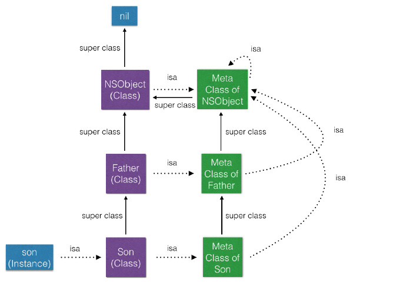

# Interview-Question

iOS 面试题积累 - iOS 篇3

### 索引

61. [drawRect](./interview-questions3.md#61-drawrect)
62. [class 源码](./interview-questions3.md#62-class-源码)
63. [[Class class] [id class]](/interview-questions3.md#63-class-class-id-class)
64. [什么是堆？什么是栈？他们之间有什么区别和联系？](./interview-questions3.md#64-什么是堆什么是栈他们之间有什么区别和联系)
65. [HTTP断点续传](./interview-questions3.md#65-http断点续传)
66. [KVO底层原理](./interview-questions3.md#66-kvo底层原理)
67. [NSMutableArray 底层实现](/interview-questions3.md#67-nsmutablearray-底层实现)
68. [并行、并发](./interview-questions3.md#68-并行并发)
69. [runtime 之 class 与 meta class](./interview-questions3.md#69-runtime-之-class-与-meta-class)
70. [Tagged Pointer](./interview-questions3.md#70-tagged-pointer)
71. [AddressSanitizer VS Zombie](./interview-questions3.md#71-addresssanitizer-vs-zombie)
72. [Swift Protocol VS OC Protocol](./interview-questions3.md#72-swift-protocol-vs-oc-protocol)
73. [面向对象 VS 面向协议](./interview-questions3.md#73-面向对象-vs-面向协议)

------

### 61. drawRect

1. drawRect 简介：

   - `drawRect`方法在`UIView`的使用上起着十分关键的作用。不知道大家注意过没有，每一次创建`UIView`子类文件时候，会有自动带有已注释的`drawRect`方法，也许从这一点就能看出这个方法的重要性。

   - 该方法定义在`UIView(UIViewRendering)`分类里面，望文生义，该方法完成视图的绘制。

2. drawRect作用：

   - `Only override drawRect: if you perform custom drawing.`
   - 重绘作用：重写该方法以实现自定义的绘制内容

3. 调用场景
   - 视图第一次显示的时候会调用。这个是由系统自动调用的，主要是在`UIViewController`中`loadView`和`viewDidLoad`方法调用之后；
   - 如果在`UIView`初始化时没有设置rect大小，将直接导致`drawRect`不被自动调用；
   - 该方法在调用`sizeThatFits`后被调用,所以可以先调用`sizeToFit`计算出`size`,然后系统自动调用`drawRect:`方法；
   - 通过设置`contentMode`属性值为`UIViewContentModeRedraw`,那么将在每次设置或更改`frame`的时候自动调用`drawRect:`;
   - 直接调用`setNeedsDisplay`，或者`setNeedsDisplayInRect:`触发`drawRect:`，但是有个前提条件是`rect`不能为0;

4. 注意事项
   - 如果子类直接继承自`UIView`,则在`drawRect` 方法中不需要调用`super`方法。若子类继承自其他`View`类则需要调用`super`方法以实现重绘。
   - 若使用`UIView`绘图，只能在`drawRect:`方法中获取绘制视图的contextRef。在其他方法中获取的contextRef都是不生效的；
   - `drawRect:`方法不能手动调用，需要调用实例方法`setNeedsDisplay`或者`setNeedsDisplayInRect`,让系统自动调用该方法；
   - 若使用`CALayer`绘图，只能在`drawInContext :`绘制，或者在`delegate`方法中进行绘制，然后调用`setNeedDisplay`方法实现最终的绘制；
   - 若要实时画图，不能使用gestureRecognizer，只能使用touchbegan等方法来掉用setNeedsDisplay实时刷新屏幕 ------这个阐述需要调整
   - `UIImageView`继承自`UIView`,但是`UIImageView`能不重写`drawRect`方法用于实现自定义绘图。

参考：[谈谈对drawRect的理解](https://www.jianshu.com/p/7242bc413ca8)

### 62. class 源码

Class是一个objc_class结构体的指针

```
/// An opaque type that represents an Objective-C class.
typedef struct objc_class *Class;
```

```
struct objc_class {
    Class isa  OBJC_ISA_AVAILABILITY;

#if !__OBJC2__
    Class super_class                                        OBJC2_UNAVAILABLE;
    const char *name                                         OBJC2_UNAVAILABLE;
    long version                                             OBJC2_UNAVAILABLE;
    long info                                                OBJC2_UNAVAILABLE;
    long instance_size                                       OBJC2_UNAVAILABLE;
    struct objc_ivar_list *ivars                             OBJC2_UNAVAILABLE;
    struct objc_method_list **methodLists                    OBJC2_UNAVAILABLE;
    struct objc_cache *cache                                 OBJC2_UNAVAILABLE;
    struct objc_protocol_list *protocols                     OBJC2_UNAVAILABLE;
#endif

} OBJC2_UNAVAILABLE;
```

参考：[Objective-C对象解析](https://www.jianshu.com/p/e3445ad41dbf)

### 63. [Class class] [id class]

我们觉得`[NSObject class]` 应该返回他是个什么东西也就是`isa`指针指向的内容，我们从这边入手。

```
- (id)self {
    return self;
}

+ (Class)class {
    return self;
}

- (Class)class {
    return object_getClass(self);
}

+ (Class)superclass {
    return self->superclass;
}

- (Class)superclass {
    return [self class]->superclass;
}

+ (BOOL)isMemberOfClass:(Class)cls {
    return object_getClass((id)self) == cls;
}

- (BOOL)isMemberOfClass:(Class)cls {
    return [self class] == cls;
}
```

```
Class object_getClass(id obj)
{
    if (obj) return obj->getIsa();
    else return Nil;
}
```

总结：

类方法`+ (Class)class`返回类本身；

实例方法`- (Class)class`返回isa指针，也就是他的类的指针，对于类则指向元类。

### 64. 什么是堆？什么是栈？他们之间有什么区别和联系？

请分别解释下操作系统和数据结构中的“堆”和“栈”概念。

注意区分堆和栈在操作系统和数据结构中的区别。

数据结构：

> 栈就像装数据的桶或箱子.
> 我们先从大家比较熟悉的栈说起吧，它是一种具有后进先出性质的数据结构，也就是说后存放的先取，先存放的后取。这就如同我们要取出放在箱子里面底下的东西（放入的比较早的物体），我们首先要移开压在它上面的物体（放入的比较晚的物体）。

>堆像一棵倒过来的树
>而堆就不同了，堆是一种经过排序的树形数据结构，每个结点都有一个值。通常我们所说的堆的数据结构，是指二叉堆。堆的特点是根结点的值最小（或最大），且根结点的两个子树也是一个堆。由于堆的这个特性，常用来实现优先队列，堆的存取是随意，这就如同我们在图书馆的书架上取书，虽然书的摆放是有顺序的，但是我们想取任意一本时不必像栈一样，先取出前面所有的书，书架这种机制不同于箱子，我们可以直接取出我们想要的书。

操作系统：

>内存中的栈区处于相对较高的地址以地址的增长方向为上的话，栈地址是向下增长的，栈中分配局部变量空间，
>
>堆区是向上增长的用于分配程序员申请的内存空间，一般堆的数据结构是链表。

参考：[数据结构中的堆和栈 与 内存分配中的堆区和栈区 分析](https://blog.csdn.net/hustyangju/article/details/25286689)

### 65. HTTP断点续传

1. 简述

   断点续传：指的是在上传/下载时，将任务（一个文件或压缩包）人为的划分为几个部分，每一个部分采用一个线程进行上传/下载，如果碰到网络故障，可以从已经上传/下载的部分开始继续上传/下载未完成的部分，而没有必要从头开始上传/下载。可以节省时间，提高速度。

2. Range & Content-Range

   HTTP1.1 协议（RFC2616）开始支持获取文件的部分内容，这为并行下载以及断点续传提供了技术支持。它通过在 Header 里两个参数实现的，客户端发请求时对应的是 Range ，服务器端响应时对应的是 Content-Range。

   - Range

     用于请求头中，指定第一个字节的位置和最后一个字节的位置，一般格式：

     ```
     Range:(unit=first byte pos)-[last byte pos]
     ```

   - Content-Range

     用于响应头中，在发出带 Range 的请求后，服务器会在 Content-Range 头部返回当前接受的范围和文件总大小。一般格式：

     ```
     Content-Range: bytes (unit first byte pos) - [last byte pos]/[entity legth]
     ```

     而在响应完成后，返回的响应头内容也不同：

     ```
     HTTP/1.1 200 Ok（不使用断点续传方式） 
     HTTP/1.1 206 Partial Content（使用断点续传方式）
     ```

**增强校验**

在实际场景中，会出现一种情况，即在终端发起续传请求时，URL 对应的文件内容在服务器端已经发生变化，此时续传的数据肯定是错误的。如何解决这个问题了？显然此时需要有一个标识文件唯一性的方法。

在 RFC2616 中也有相应的定义，比如实现 Last-Modified 来标识文件的最后修改时间，这样即可判断出续传文件时是否已经发生过改动。同时 FC2616 中还定义有一个 ETag 的头，可以使用 ETag 头来放置文件的唯一标识。

3. Last-Modified

   If-Modified-Since，和 Last-Modified 一样都是用于记录页面最后修改时间的 HTTP 头信息，只是 Last-Modified 是由服务器往客户端发送的 HTTP 头，而 If-Modified-Since 则是由客户端往服务器发送的头，可以看到，再次请求本地存在的 cache 页面时，客户端会通过 If-Modified-Since 头将先前服务器端发过来的 Last-Modified 最后修改时间戳发送回去，这是为了让服务器端进行验证，通过这个时间戳判断客户端的页面是否是最新的，如果不是最新的，则返回新的内容，如果是最新的，则返回 304 告诉客户端其本地 cache 的页面是最新的，于是客户端就可以直接从本地加载页面了，这样在网络上传输的数据就会大大减少，同时也减轻了服务器的负担。

4. Etag

   Etag（Entity Tags）主要为了解决 Last-Modified 无法解决的一些问题。

   - 一些文件也许会周期性的更改，但是内容并不改变（仅改变修改时间），这时候我们并不希望客户端认为这个文件被修改了，而重新 GET。
   - 某些文件修改非常频繁，例如：在秒以下的时间内进行修改（1s 内修改了 N 次），If-Modified-Since 能检查到的粒度是 s 级的，这种修改无法判断（或者说 UNIX 记录 MTIME 只能精确到秒）。
   - 某些服务器不能精确的得到文件的最后修改时间。

   为此，HTTP/1.1 引入了 Etag。Etag 仅仅是一个和文件相关的标记，可以是一个版本标记，例如：v1.0.0；或者说 “627-4d648041f6b80” 这么一串看起来很神秘的编码。但是 HTTP/1.1 标准并没有规定 Etag 的内容是什么或者说要怎么实现，唯一规定的是 Etag 需要放在 “” 内。

5. If-Range

   用于判断实体是否发生改变，如果实体未改变，服务器发送客户端丢失的部分，否则发送整个实体。一般格式：

   ```
   If-Range: Etag | HTTP-Date
   ```

   也就是说，If-Range 可以使用 Etag 或者 Last-Modified 返回的值。当没有 ETage 却有 Last-modified 时，可以把 Last-modified 作为 If-Range 字段的值。

   If-Range 必须与 Range 配套使用。如果请求报文中没有 Range，那么 If-Range 就会被忽略。如果服务器不支持 If-Range，那么 Range 也会被忽略。

   如果请求报文中的 Etag 与服务器目标内容的 Etag 相等，即没有发生变化，那么应答报文的状态码为 206。如果服务器目标内容发生了变化，那么应答报文的状态码为 200。

   用于校验的其他 HTTP 头信息：If-Match/If-None-Match、If-Modified-Since/If-Unmodified-Since。

**工作原理**

Etag 由服务器端生成，客户端通过 If-Range 条件判断请求来验证资源是否修改。请求一个文件的流程如下：

第一次请求：

- 客户端发起 HTTP GET 请求一个文件。
- 服务器处理请求，返回文件内容以及相应的 Header，其中包括 Etag（例如：627-4d648041f6b80）（假设服务器支持 Etag 生成并已开启了 Etag）状态码为 200。

第二次请求（断点续传）：

- 客户端发起 HTTP GET 请求一个文件，同时发送 If-Range（该头的内容就是第一次请求时服务器返回的 Etag：627-4d648041f6b80）。
- 服务器判断接收到的 Etag 和计算出来的 Etag 是否匹配，如果匹配，那么响应的状态码为 206；否则，状态码为 200。

参考：[HTTP 断点续传（分块传输）](https://blog.csdn.net/liang19890820/article/details/53215087)

###  66. KVO底层原理

- 问：iOS用什么方式实现对一个对象的KVO？（KVO的本质是什么？） 

  答. 当一个对象使用了KVO监听，iOS系统会修改这个对象的isa指针，改为指向一个全新的通过Runtime动态创建的子类，子类拥有自己的set方法实现，set方法实现内部会顺序调用**willChangeValueForKey方法、原来的setter方法实现、didChangeValueForKey方法，而didChangeValueForKey方法内部又会调用监听器的observeValueForKeyPath:ofObject:change:context:监听方法。**

- 问：如何手动触发KVO 

  答. 被监听的属性的值被修改时，就会自动触发KVO。如果想要手动触发KVO，则需要我们自己调用**willChangeValueForKey和didChangeValueForKey**方法即可在不改变属性值的情况下手动触发KVO，并且这两个方法缺一不可。

  参考：[iOS底层原理总结 - 探寻KVO本质](https://juejin.im/post/5adab70cf265da0b736d37a8)

### 67. NSMutableArray 底层实现

- NSMutableArray的内部数据结构如下:
  offset: 有效数据起始位置偏移量
  size: 实际占用的内存大小
  used: 数组的实际的有效数据个数
  *list: 实际内存的起始地址

- 内部数据结构：环形缓冲区

  参考：[NSMutableArray原理揭露](http://blog.joyingx.me/2015/05/03/NSMutableArray 原理揭露/)

### 68. 并行、并发

你吃饭吃到一半，电话来了，你一直到吃完了以后才去接，这就说明你不支持并发也不支持并行。
你吃饭吃到一半，电话来了，你停了下来接了电话，接完后继续吃饭，这说明你支持并发。
你吃饭吃到一半，电话来了，你一边打电话一边吃饭，这说明你支持并行。

并发的关键是你有处理多个任务的能力，不一定要同时。
并行的关键是你有同时处理多个任务的能力。

所以我认为它们最关键的点就是：是否是『同时』。

参考：https://www.zhihu.com/question/33515481

### 69. runtime 之 class 与 meta class

1. id

   在 objc.h 中我们可以看到id的定义

   ```
   /// A pointer to an instance of a class.
   typedef struct objc_object *id;
   ```

2. objc_object

   在 objc.h 中我们也能看到如下定义

   ```
   /// Represents an instance of a class.
   struct objc_object {
       Class isa  OBJC_ISA_AVAILABILITY;
   };
   ```

   于是我们知道了`objc_object`会被转换成 C 的结构体，而在这个struct中有一个 isa 指针，指向它的类 Class。

3. Class

   ```
   /// An opaque type that represents an Objective-C class.
   typedef struct objc_class *Class;
   ```

   发现 Class 本身指向的也是一个 C 的 struct `objc_class`。

4. objc_class

   在 runtime.h 中我们可以看到如下定义：

   ```
   struct objc_class {
       Class isa  OBJC_ISA_AVAILABILITY;
   
   #if !__OBJC2__
       Class super_class                                        OBJC2_UNAVAILABLE;
       const char *name                                         OBJC2_UNAVAILABLE;
       long version                                             OBJC2_UNAVAILABLE;
       long info                                                OBJC2_UNAVAILABLE;
       long instance_size                                       OBJC2_UNAVAILABLE;
       struct objc_ivar_list *ivars                             OBJC2_UNAVAILABLE;
       struct objc_method_list **methodLists                    OBJC2_UNAVAILABLE;
       struct objc_cache *cache                                 OBJC2_UNAVAILABLE;
       struct objc_protocol_list *protocols                     OBJC2_UNAVAILABLE;
   #endif
   
   } OBJC2_UNAVAILABLE;
   /* Use `Class` instead of `struct objc_class *` */
   ```

5. MetaClass

   我们发现 Class 本身也有一个 `isa` 指针，指向的是它的 `MetaClass`。

   - 当我们对一个实例发送消息时（-开头的方法），会在该 instance 对应的类的 methodLists 里查找。
   - 当我们对一个类发送消息时（+开头的方法），会在该类的 MetaClass 的 methodLists 里查找。

   这一过程如下图所示：

   

   - 每个 Class 都有一个 isa 指针指向一个唯一的 Meta Class
   - 每一个 Meta Class 的 isa 指针都指向最上层的 Meta Class，即 NSObject 的 MetaClass，而最上层的 MetaClass 的 isa 指针又指向自己

参考：[iOS runtime 之 Class 和 MetaClass](https://www.jianshu.com/p/8036f15c91c6)

### 70. Tagged Pointer

> 由一个问题引入：
>
> 先定义：
>
> ```
> @property (nonatomic, copy) NSString *test;
> ```
>
> 方法一：
>
> ```
>   for (int i = 0; i < 1000; i++) {
>       dispatch_async(dispatch_get_global_queue(0, 0), ^{
>           self.test = [NSString stringWithFormat:@"%@",@"123"];
>       });
>   }
> ```
>
> 方法二：
>
> ```
>   for (int i = 0; i < 1000; i++) {
>       dispatch_async(dispatch_get_global_queue(0, 0), ^{
>           self.test = [NSString stringWithFormat:@"%@",@"abababababababababababababab"];
>       });
>   }
> ```
>
> 结果：方法一运行正常，方法二奔溃。奔溃是由于多线程访问了线程不安全的属性。
>
> 那为什么方法一不会奔溃？

Tagged Pointer 是一个能够提升性能、节省内存的有趣的技术。

- Tagged Pointer 专门用来存储小的对象，例如 **NSNumber** 和 **NSDate**（后来可以存储小字符串）
- Tagged Pointer 指针的值不再是地址了，而是真正的值。所以，实际上它不再是一个对象了，它只是一个披着对象皮的普通变量而已。
- 它的内存并不存储在堆中，也不需要 malloc 和 free，所以拥有极快的读取和创建速度。

正常对象都是 指针指向对象的地址, 指针指向堆内存中的地址，所以方法二会因为多线程访问而造成坏内存访问，而TaggedPointer 则不会创建内存，而是在isa指针上做手脚。在指针上存放具体值。

- 0结尾的为对象地址 因为以16位为基准 内存对齐
- 当在`iOS平台` ，当尾数为1的时候为TaggedPointer

参考：[Tagged Pointer](https://juejin.im/post/5d77751ce51d4561eb0b2714)

### 71. AddressSanitizer VS Zombie

1. `zombie`：
   zombie的原理是用生成僵尸对象来替换dealloc的实现，当对象引用计数为0的时候，将需要dealloc的对象转化为僵尸对象。如果之后再给这个僵尸对象发消息，则抛出异常，并打印出相应的信息，调试者可以很轻松的找到异常发生位置。
2. `AddressSanitizer`：
   AddressSanitizer的原理是当程序创建变量分配一段内存时，将此内存后面的一段内存也冻结住，标识为中毒内存。

参考：[Xcode7新特性AddressSanitizer](https://www.jianshu.com/p/ddb32f683a54)

### 72. Swift Protocol VS OC Protocol

OC中的Protocol因为支持可选方法、因为总被用于代理模式、因为OC不是强类型语言，导致了OC中的Protocol并没有发挥该有的作用。

但Swift对Protocol做出了很好的支持：比如支持继承、支持结构体的遵守、支持默认实现等。

### 73. 面向对象 VS 面向协议

`面向对象`和`面向协议`的的最明显区别是`对抽象数据的使用方式`，面向对象采用的是**继承**，而`面向协议`采用的是**遵守协议**。在`面向协议`设计中，`Apple`建议我们更多的使用 **值类型**（`struct`）而非 **引用类型**（`class`）。[这篇文章](https://link.juejin.im/?target=https%3A%2F%2Fchausson.github.io%2F2017%2F03%2F01%2F%E9%9D%A2%E5%90%91%E5%8D%8F%E8%AE%AE-POP-%E4%BB%A5%E9%9D%A2%E5%90%91%E5%AF%B9%E8%B1%A1-OOP%2F)中有一个很好的例子说明了`面向协议`比`面向对象`更符合**某些业务需求**。其中有飞机、汽车、自行车三种交通工具（均继承自父类交通工具）；老虎、马三种动物（均继承父类自动物）；在古代马其实也是一种交通工具，但是父类是动物，如果马也有交通工具的功能，则：

如果采用`面向对象编程`，则需要既要继承动物，还要继承交通工具，但是父类交通工具有些功能马是不需要的。由此可见**继承**，作为**代码复用**的一种方式，**耦合性**还是太强。**事物往往是一系列特质的组合，而不单单是以一脉相承并逐渐扩展的方式构建的。**`以后慢慢会发现面向对象很多时候其实不能很好地对事物进行抽象。`

如果采用`面向协议编程`，马只需要实现出行协议就可以拥有交通工具的功能了。**面向协议就是这样的抽离方式，更好的职责划分，更加具象化，职责更加单一。很明显面向协议的目的是为了降低代码的耦合性**。

参考：[来一次有侧重点的区分Swift与Objective-C](https://juejin.im/post/5c653aa6e51d457fbf5dc298)

### 74. 设计模式六大原则

1、单一职责原则（Single Responsibility Principle，简称SRP ）

- **核心思想:** 应该有且仅有一个原因引起类的变更
- **问题描述：** 假如有类Class1完成职责T1，T2，当职责T1或T2有变更需要修改时，有可能影响到该类的另外一个职责正常工作。
- **好处：** 类的复杂度降低、可读性提高、可维护性提高、扩展性提高、降低了变更引起的风险。
- **需注意：** 单一职责原则提出了一个编写程序的标准，用“职责”或“变化原因”来衡量接口或类设计得是否优良，但是“职责”和“变化原因”都是不可以度量的，因项目和环境而异。

2、里氏替换原则（Liskov Substitution Principle,简称LSP）

- **核心思想：** 在使用基类的的地方可以任意使用其子类，能保证子类完美替换基类。
- **通俗来讲：** 只要父类能出现的地方子类就能出现。反之，父类则未必能胜任。
- **好处：** 增强程序的健壮性，即使增加了子类，原有的子类还可以继续运行。
- **需注意：** 如果子类不能完整地实现父类的方法，或者父类的某些方法在子类中已经发生“畸变”，则建议断开父子继承关系 采用依赖、聚合、组合等关系代替继承。

3、依赖倒置原则（Dependence Inversion Principle,简称DIP）

**核心思想：**高层模块不应该依赖底层模块，二者都该依赖其抽象；抽象不应该依赖细节；细节应该依赖抽象；

**说明：**高层模块就是调用端，低层模块就是具体实现类。抽象就是指接口或抽象类。细节就是实现类。

**通俗来讲：** 依赖倒置原则的本质就是通过抽象（接口或抽象类）使个各类或模块的实现彼此独立，互不影响，实现模块间的松耦合。

**问题描述：** 类A直接依赖类B，假如要将类A改为依赖类C，则必须通过修改类A的代码来达成。这种场景下，类A一般是高层模块，负责复杂的业务逻辑；类B和类C是低层模块，负责基本的原子操作；假如修改类A，会给程序带来不必要的风险。

**解决方案：** 将类A修改为依赖接口interface，类B和类C各自实现接口interface，类A通过接口interface间接与类B或者类C发生联系，则会大大降低修改类A的几率。

**好处：**依赖倒置的好处在小型项目中很难体现出来。但在大中型项目中可以减少需求变化引起的工作量。使并行开发更友好。

4、接口隔离原则（Interface Segregation Principle,简称ISP）

- **核心思想：**类间的依赖关系应该建立在最小的接口上
- **通俗来讲：** 建立单一接口，不要建立庞大臃肿的接口，尽量细化接口，接口中的方法尽量少。也就是说，我们要为各个类建立专用的接口，而不要试图去建立一个很庞大的接口供所有依赖它的类去调用。
- **问题描述：** 类A通过接口interface依赖类B，类C通过接口interface依赖类D，如果接口interface对于类A和类B来说不是最小接口，则类B和类D必须去实现他们不需要的方法。
- **需注意：**
- **接口尽量小，但是要有限度**。对接口进行细化可以提高程序设计灵活性，但是如果过小，则会造成接口数量过多，使设计复杂化。所以一定要适度
- **提高内聚，减少对外交互**。使接口用最少的方法去完成最多的事情
- **为依赖接口的类定制服务**。只暴露给调用的类它需要的方法，它不需要的方法则隐藏起来。只有专注地为一个模块提供定制服务，才能建立最小的依赖关系。

5、迪米特法则（Law of Demeter,简称LoD）

- **核心思想：** 类间解耦。
- **通俗来讲：** 一个类对自己依赖的类知道的越少越好。自从我们接触编程开始，就知道了软件编程的总的原则：低耦合，高内聚。无论是面向过程编程还是面向对象编程，只有使各个模块之间的耦合尽量的低，才能提高代码的复用率。低耦合的优点不言而喻，但是怎么样编程才能做到低耦合呢？那正是迪米特法则要去完成的。

6、开放封闭原则（Open Close Principle,简称OCP）

- **核心思想：** 尽量通过扩展软件实体来解决需求变化，而不是通过修改已有的代码来完成变化
- **通俗来讲：** 一个软件产品在生命周期内，都会发生变化，既然变化是一个既定的事实，我们就应该在设计的时候尽量适应这些变化，以提高项目的稳定性和灵活性。

**一句话概括:** 单一职责原则告诉我们实现类要职责单一；里氏替换原则告诉我们不要破坏继承体系；依赖倒置原则告诉我们要面向接口编程；接口隔离原则告诉我们在设计接口的时候要精简单一；迪米特法则告诉我们要降低耦合。而开闭原则是总纲，他告诉我们要对扩展开放，对修改关闭。

**总结：**

最后总结一下如何去遵守这六个原则。对这六个原则的遵守并不是是和否的问题，而是多和少的问题，也就是说，我们一般不会说有没有遵守，而是说遵守程度的多少。任何事都是过犹不及，设计模式的六个设计原则也是一样，制定这六个原则的目的并不是要我们刻板的遵守他们，而需要根据实际情况灵活运用。对他们的遵守程度只要在一个合理的范围内，就算是良好的设计。我们用一幅图来说明一下。

参考：[快速理解 设计模式六大原则](https://zhuanlan.zhihu.com/p/33607390)


-----


待补充：

1. TCP/UDP
2. 组件化